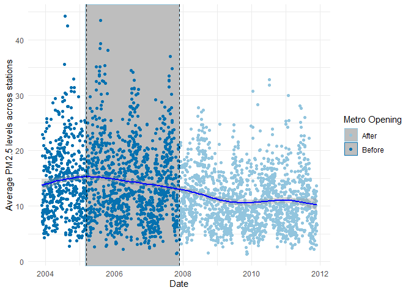

# Team Charlotte Weekly Report
Adityaraj Padmanabhna & David Guan

## Research Question

1.  Does the introduction of light rails affect the particulate matter
    (PM2.5) levels in Charlotte, North Carolina?
2.  Do different income brackets have different levels of reduction
    after introducing light rails?

## Hypothesis

1.  **Light Rail opening:**
    - Null Hypothesis (H₀): The introduction of light rails has no
      effect on particulate matter (PM2.5) levels in Charlotte, North
      Carolina.​

    - Alternative Hypothesis (H<sub>A</sub>): The introduction of light
      rails has an effect on particulate matter (PM2.5) levels in
      Charlotte, North Carolina.
2.  **Income:**
    - Null Hypothesis (H₀): There is no difference in the levels of
      PM2.5 reduction across different income brackets after introducing
      light rails.

    - Alternative Hypothesis (H<sub>A</sub>): There is a difference in
      the levels of PM2.5 reduction across different income brackets
      after introducing light rails.

## Context

- Area of study: Blue Lynx Light Rail, Charlotte, North Caroline

  - Table with corresponding above stations

    ``` r
    library("knitr")

    stations_table <- read.csv("new_station_coords_data.csv")
    kable(stations_table)
    ```

    | stations                               | Opening.Dates                                 | Parking   |       lon |                                         lat | address                                                                 |      lat2 |                                        lon2 | address2                                                                |
    |:---------------------------------------|:----------------------------------------------|:----------|----------:|--------------------------------------------:|:------------------------------------------------------------------------|----------:|--------------------------------------------:|:------------------------------------------------------------------------|
    | I-485/South Boulevard                  | November 24, 2007                             | TRUE      | -80.88292 |                                    35.10708 | i-485/south boulevard station, charlotte, nc 28134, usa                 |  35.10708 |                                   -80.88292 | i-485/south boulevard station, charlotte, nc 28134, usa                 |
    | Sharon Road West station               | November 24, 2007                             | TRUE      | -80.88219 |                                    35.11927 | sharon road west station, charlotte, nc 28134, usa                      |  35.11927 |                                   -80.88219 | sharon road west station, charlotte, nc 28134, usa                      |
    | Arrowood station                       | November 24, 2007                             | TRUE      | -80.87637 |                                    35.13569 | arrowood, 7717 england st, charlotte, nc 28273, usa                     |  35.13569 |                                   -80.87637 | arrowood, 7717 england st, charlotte, nc 28273, usa                     |
    | Archdale station                       | November 24, 2007                             | TRUE      | -80.87748 |                                    35.15290 | archdale, charlotte, nc 28217, usa                                      |  35.15290 |                                   -80.87748 | archdale, charlotte, nc 28217, usa                                      |
    | Tyvola station                         | November 24, 2007                             | TRUE      | -80.87750 |                                    35.16285 | tyvola, 5703 old pineville rd, charlotte, nc 28217, usa                 |  35.16285 |                                   -80.87750 | tyvola, 5703 old pineville rd, charlotte, nc 28217, usa                 |
    | Woodlawn station (Charlotte)           | November 24, 2007                             | TRUE      | -80.87930 |                                    35.17590 | woodlawn station, charlotte, nc 28217, usa                              |  35.17590 |                                   -80.87930 | woodlawn station, charlotte, nc 28217, usa                              |
    | Scaleybark station                     | November 24, 2007                             | FALSE     | -80.87501 |                                    35.19092 | scaleybark, charlotte, nc 28217, usa                                    |  35.19092 |                                   -80.87501 | scaleybark, charlotte, nc 28217, usa                                    |
    | New Bern station                       | November 24, 2007                             | FALSE     | -80.86904 |                                    35.19985 | new bern station, charlotte, nc 28209, usa                              |  35.19985 |                                   -80.86904 | new bern station, charlotte, nc 28209, usa                              |
    | East/West Boulevard station            | August 30, 1996 \| (rebuilt November 24, 2007 |           |           |                                             |                                                                         |           |                                             |                                                                         |
    | )                                      | FALSE                                         | -80.85895 |  35.21212 | east/west station, charlotte, nc 28203, usa | 35.21212                                                                | -80.85895 | east/west station, charlotte, nc 28203, usa |                                                                         |
    | Bland Street station                   | August 30, 1996 \| (rebuilt November 24, 2007 |           |           |                                             |                                                                         |           |                                             |                                                                         |
    | )                                      | FALSE                                         | -80.85525 |  35.21582 |             bland, charlotte, nc 28203, usa | 35.21622                                                                | -80.85446 |        1511 Camden Road, charlotte, nc, usa |                                                                         |
    | Carson light rail station (Charlotte)  | November 24, 2007                             | FALSE     | -80.84313 |                                    35.22709 | charlotte, nc, usa                                                      |  35.21944 |                                   -80.84823 | 218 East Carson Boulevard, charlotte, nc, usa                           |
    | Brooklyn Village (Charlotte)           | August 30, 1996 \| (rebuilt November 24, 2007 |           |           |                                             |                                                                         |           |                                             |                                                                         |
    | )                                      | FALSE                                         | -80.84299 |  35.21867 |      e brooklyn vlg ave, charlotte, nc, usa | 35.21867                                                                | -80.84299 |      e brooklyn vlg ave, charlotte, nc, usa |                                                                         |
    | Third Street/Convention Center station | June 28, 2004 \| (rebuilt November 24, 2007)  | FALSE     | -80.84312 |                                    35.22375 | 3rd st./convention center, charlotte, nc 28244, usa                     |  35.22375 |                                   -80.84312 | 3rd st./convention center, charlotte, nc 28244, usa                     |
    | Charlotte Transportation Center        | November 24, 2007                             | FALSE     | -80.84313 |                                    35.22709 | charlotte, nc, usa                                                      |  35.21944 |                                   -80.84823 | 310 East Trade Street, charlotte, nc, usa                               |
    | 7th Street station (Charlotte)         | June 28, 2004 \| (rebuilt November 24, 2007)  | FALSE     | -80.83798 |                                    35.22751 | 7th st station, charlotte, nc 28202, usa                                |  35.22751 |                                   -80.83798 | 7th st station, charlotte, nc 28202, usa                                |
    | 9th Street station (Charlotte)         | June 24, 2004 \| (rebuilt March 16, 2018)     | FALSE     | -80.83516 |                                    35.22948 | 239 e 9th st, charlotte, nc 28202, usa                                  |  35.22948 |                                   -80.83516 | 239 e 9th st, charlotte, nc 28202, usa                                  |
    | Parkwood station                       | March 16, 2018                                | FALSE     | -80.82323 |                                    35.23689 | parkwood, charlotte, nc 28206, usa                                      |  35.23689 |                                   -80.82323 | parkwood, charlotte, nc 28206, usa                                      |
    | 25th Street station (Charlotte)        | March 16, 2018                                | FALSE     | -80.81708 |                                    35.24174 | 25th street, charlotte, nc 28206, usa                                   |  35.24174 |                                   -80.81708 | 25th street, charlotte, nc 28206, usa                                   |
    | 36th Street station (Charlotte)        | March 16, 2018                                | FALSE     | -80.80545 |                                    35.24854 | 36th street station, charlotte, nc 28205, usa                           |  35.24854 |                                   -80.80545 | 36th street station, charlotte, nc 28205, usa                           |
    | Sugar Creek station (Charlotte)        | March 16, 2018                                | TRUE      | -80.79184 |                                    35.25106 | sugar creek station, bearwood ave, charlotte, nc 28205, usa             |  35.25106 |                                   -80.79184 | sugar creek station, bearwood ave, charlotte, nc 28205, usa             |
    | Old Concord Road station               | March 16, 2018                                | TRUE      | -80.77271 |                                    35.25996 | old concord road station, charlotte, nc 28213, usa                      |  35.25996 |                                   -80.77271 | old concord road station, charlotte, nc 28213, usa                      |
    | Tom Hunter station                     | March 16, 2018                                | FALSE     | -80.76629 |                                    35.27795 | tom hunter station, charlotte, nc 28213, usa                            |  35.27795 |                                   -80.76629 | tom hunter station, charlotte, nc 28213, usa                            |
    | University City Blvd station           | March 16, 2018                                | TRUE      | -80.76074 |                                    35.28692 | university city blvd, 7205 n tryon st, charlotte, nc 28262, usa         |  35.28692 |                                   -80.76074 | university city blvd, 7205 n tryon st, charlotte, nc 28262, usa         |
    | McCullough station                     | March 16, 2018                                | FALSE     | -80.75288 |                                    35.30112 | mccullough, 8312 n tryon st, charlotte, nc 28262, usa                   |  35.30112 |                                   -80.75288 | mccullough, 8312 n tryon st, charlotte, nc 28262, usa                   |
    | JW Clay Blvd/UNC Charlotte station     | March 16, 2018                                | TRUE      | -80.74503 |                                    35.31083 | 9234-9300 n tryon st, charlotte, nc 28262, usa                          |  35.31155 |                                   -80.74547 | 9048 North Tryon Street, charlotte, nc, usa                             |
    | UNC Charlotte–Main station             | March 16, 2018                                | FALSE     | -80.73371 |                                    35.31218 | unc charlotte main station, 9025 cameron blvd, charlotte, nc 28262, usa |  35.31218 |                                   -80.73371 | unc charlotte main station, 9025 cameron blvd, charlotte, nc 28262, usa |

- Time Frame: November 2003 - November 2011

- Factors associated with PM2.5

  - Airport

  - Power Plant(s)

  - Factories

  - Major Intersection

    - Table with corresponding above factors

      ``` r
      factors_table <- read.csv("new_pm_coords_data.csv")
      kable(factors_table)
      ```

      | Type          | sources                                                 | Address                                                                | Reason.s.                                                                                       |       lon |      lat | address                                                                                            |     lat2 |      lon2 | address2                                                                                           |
      |:--------------|:--------------------------------------------------------|:-----------------------------------------------------------------------|:------------------------------------------------------------------------------------------------|----------:|---------:|:---------------------------------------------------------------------------------------------------|---------:|----------:|:---------------------------------------------------------------------------------------------------|
      | Power Plant   | GG Allen steam station                                  | 253 Plant Allen Rd, Belmont, NC 28012                                  | Coal-fired power plant.                                                                         | -81.00855 | 35.18982 | 253 plant allen rd, belmont, nc 28012, usa                                                         | 35.18982 | -81.00855 | 253 plant allen rd, belmont, nc 28012, usa                                                         |
      | Neighbourhood | South End                                               | South End, Charlotte, NC 28203                                         | Once heavily industrial, still contains some light industrial facilities despite redevelopment. | -80.85878 | 35.21256 | south end, charlotte, nc 28203, usa                                                                | 35.21256 | -80.85878 | south end, charlotte, nc 28203, usa                                                                |
      | Airport       | Charlotte Douglas International Airport                 | 5501 Josh Birmingham Pkwy, Charlotte, NC 28208                         |                                                                                                 | -80.95395 | 35.21630 | charlotte douglas international airport (clt), 5501 josh birmingham pkwy, charlotte, nc 28208, usa | 35.21630 | -80.95395 | charlotte douglas international airport (clt), 5501 josh birmingham pkwy, charlotte, nc 28208, usa |
      | Intersection  | Ardrey Kell Rd Rea Rd                                   | Ardrey Kell Rd Rea Rd, Charlotte, NC                                   |                                                                                                 | -80.80554 | 35.03361 | ardrey kell rd & rea rd, charlotte, nc 28277, usa                                                  | 35.03361 | -80.80554 | ardrey kell rd & rea rd, charlotte, nc 28277, usa                                                  |
      | Intersection  | Ardrey Kell Rd Tom Short Rd                             | Ardrey Kell Rd Tom Short Rd, Charlotte, NC                             |                                                                                                 | -80.79392 | 35.04063 | ardrey kell rd & tom short rd, providence crossing, nc 28277, usa                                  | 35.04063 | -80.79392 | ardrey kell rd & tom short rd, providence crossing, nc 28277, usa                                  |
      | Intersection  | Back Creek Church Rd Pavilion Blvd University City Blvd | Back Creek Church Rd Pavilion Blvd University City Blvd, Charlotte, NC |                                                                                                 | -80.71236 | 35.31127 | pavilion blvd & university city blvd, charlotte, nc 28262, usa                                     | 35.31127 | -80.71236 | pavilion blvd & university city blvd, charlotte, nc 28262, usa                                     |
      | Intersection  | Ballantyne Commons Pkwy Johnston Rd                     | Ballantyne Commons Pkwy Johnston Rd, Charlotte, NC                     |                                                                                                 | -80.85015 | 35.05458 | ballantyne commons pkwy & johnston rd, charlotte, nc 28277, usa                                    | 35.05458 | -80.85015 | ballantyne commons pkwy & johnston rd, charlotte, nc 28277, usa                                    |
      | Intersection  | Ballantyne Commons Pkwy Rea Rd                          | Ballantyne Commons Pkwy Rea Rd, Charlotte, NC                          |                                                                                                 | -80.81236 | 35.05821 | ballantyne commons pkwy & rea rd, charlotte, nc 28277, usa                                         | 35.05821 | -80.81236 | ballantyne commons pkwy & rea rd, charlotte, nc 28277, usa                                         |
      | Intersection  | Billy Graham Pkwy S Tryon St Woodlawn Rd                | Billy Graham Pkwy S Tryon St Woodlawn Rd, Charlotte, NC                |                                                                                                 | -80.88929 | 35.18067 | s tryon st & billy graham pkwy, charlotte, nc 28217, usa                                           | 35.18067 | -80.88929 | s tryon st & billy graham pkwy, charlotte, nc 28217, usa                                           |
      | Intersection  | Billy Graham Pkwy West Bv                               | Billy Graham Pkwy West Bv, Charlotte, NC                               |                                                                                                 | -80.92205 | 35.20614 | billy graham pkwy & west blvd, charlotte, nc 28208, usa                                            | 35.20614 | -80.92205 | billy graham pkwy & west blvd, charlotte, nc 28208, usa                                            |
      | Intersection  | Brookshire Blvd Mt Holly Huntersville Rd                | Brookshire Blvd Mt Holly Huntersville Rd, Charlotte, NC                |                                                                                                 | -80.94522 | 35.32554 | brookshire blvd & mt holly-huntersville rd, charlotte, nc 28216, usa                               | 35.32554 | -80.94522 | brookshire blvd & mt holly-huntersville rd, charlotte, nc 28216, usa                               |
      | Intersection  | Carmel Rd Colony Rd                                     | Carmel Rd Colony Rd, Charlotte, NC                                     |                                                                                                 | -80.80911 | 35.13259 | colony rd & carmel rd, charlotte, nc 28226, usa                                                    | 35.13259 | -80.80911 | colony rd & carmel rd, charlotte, nc 28226, usa                                                    |
      | Intersection  | Charlottetowne Av I-277 OL Ramp Kenilworth Av           | Charlottetowne Av I-277 OL Ramp Kenilworth Av, Charlotte, NC           |                                                                                                 |        NA |       NA | NA                                                                                                 | 35.21393 | -80.83748 | Charlottetowne Av I-277 OL Ramp Kenilworth Av, Charlotte, NC                                       |
      | Intersection  | Colony Rd Fairview Rd                                   | Colony Rd Fairview Rd, Charlotte, NC                                   |                                                                                                 | -80.81929 | 35.14667 | fairview rd & colony rd, charlotte, nc 28226, usa                                                  | 35.14667 | -80.81929 | fairview rd & colony rd, charlotte, nc 28226, usa                                                  |
      | Intersection  | Colville Rd Laurel Av Randolph Rd                       | Colville Rd Laurel Av Randolph Rd, Charlotte, NC                       |                                                                                                 | -80.81838 | 35.19667 | colville rd, charlotte, nc 28207, usa                                                              | 35.19667 | -80.81838 | colville rd, charlotte, nc 28207, usa                                                              |
      | Intersection  | Fairview Rd Park Road Tyvola Rd                         | Fairview Rd Park Road Tyvola Rd, Charlotte, NC                         |                                                                                                 | -80.84779 | 35.15262 | fairview rd & park rd, charlotte, nc 28210, usa                                                    | 35.15262 | -80.84779 | fairview rd & park rd, charlotte, nc 28210, usa                                                    |
      | Intersection  | Fairview Rd Providence Rd Sardis Rd                     | Fairview Rd Providence Rd Sardis Rd, Charlotte, NC                     |                                                                                                 | -80.79561 | 35.15381 | fairview rd & providence rd, charlotte, nc 28211, usa                                              | 35.15381 | -80.79561 | fairview rd & providence rd, charlotte, nc 28211, usa                                              |
      | Intersection  | Fairview Rd Sharon Rd                                   | Fairview Rd Sharon Rd, Charlotte, NC                                   |                                                                                                 | -80.83079 | 35.14849 | fairview rd & sharon rd, charlotte, nc 28210, usa                                                  | 35.14849 | -80.83079 | fairview rd & sharon rd, charlotte, nc 28210, usa                                                  |
      | Intersection  | I-85 Ramps Brookshire Blvd                              | I-85 Ramps Brookshire Blvd, Charlotte, NC                              |                                                                                                 | -80.92187 | 35.30571 | brookshire blvd, north carolina, usa                                                               | 35.30571 | -80.92187 | brookshire blvd, north carolina, usa                                                               |
      | Intersection  | Independence Blvd Village Lake Dr                       | Independence Blvd Village Lake Dr, Charlotte, NC                       |                                                                                                 | -80.73939 | 35.16268 | e independence blvd & village lake dr, charlotte, nc 28227, usa                                    | 35.16268 | -80.73939 | e independence blvd & village lake dr, charlotte, nc 28227, usa                                    |
      | Intersection  | Kings Dr Morehead St                                    | Kings Dr Morehead St, Charlotte, NC                                    |                                                                                                 | -80.83608 | 35.20548 | kings dr & morehead st, charlotte, nc 28204, usa                                                   | 35.20548 | -80.83608 | kings dr & morehead st, charlotte, nc 28204, usa                                                   |
      | Intersection  | Park Rd Woodlawn Rd                                     | Park Rd Woodlawn Rd, Charlotte, NC                                     |                                                                                                 | -80.85109 | 35.17205 | park rd & woodlawn rd, charlotte, nc 28209, usa                                                    | 35.17205 | -80.85109 | park rd & woodlawn rd, charlotte, nc 28209, usa                                                    |
      | Intersection  | Pineville-Matthews Rd Providence Rd                     | Pineville-Matthews Rd Providence Rd, Charlotte, NC                     |                                                                                                 | -80.77880 | 35.09993 | providence rd & pineville-matthews rd, charlotte, nc 28277, usa                                    | 35.09993 | -80.77880 | providence rd & pineville-matthews rd, charlotte, nc 28277, usa                                    |
      | Intersection  | Providence Rd Queens Rd                                 | Providence Rd Queens Rd, Charlotte, NC                                 |                                                                                                 |        NA |       NA | NA                                                                                                 | 35.19589 | -80.82715 | Providence Rd Queens Rd, Charlotte, NC                                                             |
      | Intersection  | Providence Rd Sharon Amity Rd                           | Providence Rd Sharon Amity Rd, Charlotte, NC                           |                                                                                                 | -80.80826 | 35.17134 | providence rd & s sharon amity rd, charlotte, nc 28211, usa                                        | 35.17134 | -80.80826 | providence rd & s sharon amity rd, charlotte, nc 28211, usa                                        |
      | Intersection  | Providence Rd Wendover Rd                               | Providence Rd Wendover Rd, Charlotte, NC                               |                                                                                                 | -80.81747 | 35.17740 | providence rd & s wendover rd, charlotte, nc 28211, usa                                            | 35.17740 | -80.81747 | providence rd & s wendover rd, charlotte, nc 28211, usa                                            |
      | Intersection  | Randolph Rd Sharon Amity Rd                             | Randolph Rd Sharon Amity Rd, Charlotte, NC                             |                                                                                                 | -80.79823 | 35.17594 | randolph rd & s sharon amity rd, charlotte, nc 28211, usa                                          | 35.17594 | -80.79823 | randolph rd & s sharon amity rd, charlotte, nc 28211, usa                                          |
      | Intersection  | Randolph Rd Wendover Rd                                 | Randolph Rd Wendover Rd, Charlotte, NC                                 |                                                                                                 | -80.80757 | 35.18421 | n wendover rd & randolph rd, charlotte, nc 28211, usa                                              | 35.18421 | -80.80757 | n wendover rd & randolph rd, charlotte, nc 28211, usa                                              |
      | Intersection  | Runnymede Ln Selwyn Av Woodlawn Rd                      | Runnymede Ln Selwyn Av Woodlawn Rd, Charlotte, NC                      |                                                                                                 | -80.84076 | 35.17083 | runnymede ln & selwyn ave, charlotte, nc 28209, usa                                                | 35.17083 | -80.84076 | runnymede ln & selwyn ave, charlotte, nc 28209, usa                                                |
      | Intersection  | South Blvd Tyvola Rd                                    | South Blvd Tyvola Rd, Charlotte, NC                                    |                                                                                                 | -80.87604 | 35.16482 | tyvola rd & south blvd, charlotte, nc 28210, usa                                                   | 35.16482 | -80.87604 | tyvola rd & south blvd, charlotte, nc 28210, usa                                                   |
      | Intersection  | South Blvd Woodlawn Rd                                  | South Blvd Woodlawn Rd, Charlotte, NC                                  |                                                                                                 | -80.87582 | 35.17653 | e woodlawn rd & south blvd, charlotte, nc 28209, usa                                               | 35.17653 | -80.87582 | e woodlawn rd & south blvd, charlotte, nc 28209, usa                                               |

## Cleaning & Combining Data

### Installing Packages

``` r
# install.packages("tidyverse")
# install.packages("ggmap")
# install.packages("maptiles")
# install.packages("terra")
# install.packages("leaflet")
# install.packages("tidycensus)
# install.packages("RColorBrewer")
```

### Loading Libraries

``` r
library("tidyverse")
library("terra")
library("maptiles")
library("tidycensus")
library("RColorBrewer")
```

Gathered Data using Google API

We utilized the Google Maps API to obtain the coordinates (latitude and
longitude) and the exact addresses of all the stations mentioned in our
dataset. This process involved sending requests to the Google Maps API
with station names and receiving detailed geolocation data in response.

However, due to GitHub’s policies on not publicly sharing API keys, we
have not included the API key directly in our repository. Instead, we
have preprocessed the data and saved the geocoded results in a CSV file
named “new_station_coords_data.csv”

Cleaning Data

``` r
addrs.geo <- read.csv("new_station_coords_data.csv")
new_addr <- addrs.geo %>% 
  mutate(
    lat2 = ifelse(
      stations == "Bland Street station", 
      35.21622, 
      lat
    ), 
    lon2 = ifelse(
      stations == "Bland Street station", 
      -80.85446, 
      lon
    ),
    address2 = ifelse(
      stations == "Bland Street station", 
      "1511 Camden Road, charlotte, nc, usa", address
      
    )
  ) %>% 
  mutate(
    lat2 = ifelse(
      stations == "Carson light rail station (Charlotte)", 
      35.21944, 
      lat2
    ), 
    lon2 = ifelse(
      stations == "Carson light rail station (Charlotte)", 
      -80.84823, 
      lon2
    ),
    address2 = ifelse(
      stations == "Carson light rail station (Charlotte)", 
      "218 East Carson Boulevard, charlotte, nc, usa",
      address2
    )
  ) %>% 
  mutate(
    lat2 = ifelse(
      stations == "Charlotte Transportation Center", 
      35.21944, 
      lat2
    ), 
    lon2 = ifelse(
      stations == "Charlotte Transportation Center", 
      -80.84823, 
      lon2
    ),
    address2 = ifelse(
      stations == "Charlotte Transportation Center", 
      "310 East Trade Street, charlotte, nc, usa", address2 
    )
  ) %>% 
  
  
  mutate(
    lat2 = ifelse(
      stations == "JW Clay Blvd/UNC Charlotte station", 
      35.31155, 
      lat2
    ), 
    lon2 = ifelse(
      stations == "JW Clay Blvd/UNC Charlotte station", 
      -80.74547, 
      lon2
    ),
    address2 = ifelse(
      stations == "JW Clay Blvd/UNC Charlotte station", 
      "9048 North Tryon Street, charlotte, nc, usa", address2 
    )
  )
```

Storing Data into new CSV File

``` r
# First time users - do NOT over-wrrite CSV file
# write.csv(new_addr, "new_station_coords_data.csv", row.names = FALSE)
```

Storing Latitude and Longtitude

``` r
sample_latlon <- cbind(new_addr$lon2, new_addr$lat2)
```

Storing into Vector Data

``` r
pts <-  vect(sample_latlon)
crdref <- "+proj=longlat +datum=WGS84"
pts <- vect(sample_latlon, crs=crdref)
plot(pts)
```


### Finding PM2.5 Data

Due to the large size of the data files, the code execution was not
included in the README file. For detailed information on how PM2.5
levels were extracted, please refer to the file
“station_buffer_pm2.5.R”.

### Overlaying Stations with PM2.5

``` r
# Plot Stations
x <- vect(sample_latlon, crs = "+proj=longlat +ellps=WGS84 +datum=WGS84 +no_defs")

# Plot Factors
pm_sources <- vect("PM2.5 ShapeFiles/new_pm_coords_sources.shp")
plot(pm_sources)
```


``` r
# Plot Buffer around stations
# Target Buffer Radius =  800 meters
pts_buffer <- buffer(x, width = 800)

# Creating Buffer for Map
extent<-buffer(x, width = 200)

bg <- get_tiles(ext(extent), zoom = 11)

# Plots the background
plot(bg)

# pch=19 gives filled circles
points(x, col="blue", pch=19, cex=0.5)

# pch=17 gives filled triangles
points(pm_sources, col="purple", pch=17, cex=1)

# Plot the buffer around the stations
lines(pts_buffer, col="red")
```


Saving the Buffer’s into ShapeFile

``` r
# First time users - do NOT over-wrrite CSV file
# writeVector(pts_buffer, "new_buffer_light_rail.shp")
```

### Combining PM2.5 Daily Data

``` r
# List all CSV files in the directory
file_list <- list.files(path = "PM25_daily", pattern = "*.csv", full.names = TRUE)

# Read and combine all CSV files into one data frame
combined_df <- do.call(rbind, lapply(file_list, function(file) {
  df <- read.csv(file)
  # Assuming your date column is named 'date' and is in format '%Y%m%d'
  df$date <- as.Date(df$date, format = "%Y%m%d")
  df
}))

# Filter rows from 2003-11-24 to 2011-11-24
combined_df_filtered <- combined_df %>%
  filter(date >= as.Date("2003-11-24") & date <= as.Date("2011-11-24"))

# Write the filtered data frame to a new CSV file
write.csv(combined_df_filtered, "refined_PM25_daily_combined_data.csv", row.names = FALSE)

PM_25_with_date <- read.csv("refined_PM25_daily_combined_data.csv")

PM_25_with_date <- PM_25_with_date %>%
   mutate(formatted_date = paste(substr(date, 1, 4), substr(date, 6, 7), substr(date, 9, 10), sep = "-")) %>% mutate(station_ID = PM_25_with_date$city_num )

# First time users - do NOT over-wrrite CSV file
# write.csv(PM_25_with_date, "refined_date_PM25_daily_data.csv")
```

Creating Station ID

``` r
stations_coords <- read.csv("new_station_coords_data.csv")

stations_coords <- stations_coords %>% mutate(station_ID = row_number())

# First time users - do NOT over-wrrite CSV file
# write.csv(stations_coords, "station_coords_with_stationID_data.csv", row.names = F)
```

Creating Holiday Data

``` r
holidays_data <- read.csv("major_holidays_2000_2025.csv", header = TRUE, stringsAsFactors = FALSE)

holidays_data <- holidays_data %>% filter(date >= as.Date("2003-11-24") & date <= as.Date("2011-11-24")) %>% mutate(formatted_date = date)

# First time users - do NOT over-wrrite CSV file
# write.csv(holidays_data, "refined_holidays_data.csv", row.names = F)
```

Cumulative Data

This code chunk combines various data frames into a single data frame,
emphasizing code re usability and avoiding complexity. It integrates
data from below CSV files

1.  Stations Data
2.  PM2.5 measurements Data
3.  Meteorological Data
4.  Holidays Data

``` r
#Reading Stations Data
stationID_data <- read.csv("station_coords_with_stationID_data.csv", header = TRUE, stringsAsFactors = FALSE)[, c("stations", "station_ID", "address2")]

#Reading PM2.5 Daily Data
pm_25_data <- read.csv("refined_date_PM25_daily_data.csv", header = TRUE, stringsAsFactors = FALSE)[, c("station_ID", "formatted_date", "pm25")]

#Reading Meterological Data
met_data <- read.csv("met_data_charlotte/combinedMeteorologyDataCharlotte.csv", header = TRUE, stringsAsFactors = FALSE)[, c("Tair_f_tavg", "Wind_f_tavg", "Qair_f_tavg", "formatted_date")]

#Reading Holiday Data
holidays_data <- read.csv("refined_holidays_data.csv", header = TRUE, stringsAsFactors = FALSE)[, c("holiday", "formatted_date")]

station_pm_met_dataCombined <- merge(stationID_data,pm_25_data, by="station_ID", all = F )

station_pm_met_dataCombined <- merge(station_pm_met_dataCombined, met_data, by="formatted_date", all = F)

station_pm_met_holiday_dataCombined <- station_pm_met_dataCombined %>% left_join(holidays_data, by = "formatted_date", keep = FALSE, unmatched = "drop")
```

    Warning in left_join(., holidays_data, by = "formatted_date", keep = FALSE, : Detected an unexpected many-to-many relationship between `x` and `y`.
    ℹ Row 59125 of `x` matches multiple rows in `y`.
    ℹ Row 1 of `y` matches multiple rows in `x`.
    ℹ If a many-to-many relationship is expected, set `relationship =
      "many-to-many"` to silence this warning.

``` r
# Ordering the list by date followed by station ID
station_pm_met_holiday_dataCombined_order <- station_pm_met_holiday_dataCombined[order(station_pm_met_holiday_dataCombined$formatted_date, station_pm_met_holiday_dataCombined$station_ID), ]

# %B is used for abbrevation for Month 
station_pm_met_holiday_dataCombined_formatted <- station_pm_met_holiday_dataCombined_order %>%
  mutate(month = format(as.Date(station_pm_met_holiday_dataCombined_order$formatted_date, format = "%Y-%m-%d"), "%B")) %>% 
  mutate (day_of_week = weekdays(as.Date(station_pm_met_holiday_dataCombined_order$formatted_date, format = "%Y-%m-%d"))) %>% 
# NA = 0; Holiday = 1
  mutate(holiday_binary = ifelse(is.na(holiday), 0, 1))

# First time users - do NOT over-wrrite CSV file
# write_csv(station_pm_met_holiday_dataCombined_formatted, "station_pm_met_holiday_dataCombined_formatted.csv")
```

``` r
combinedData <- read.csv("station_pm_met_holiday_dataCombined_formatted.csv")

# No PM sources = 0; PM Source near Station = 1
binaryPMFactor <- combinedData %>% 
  mutate(control_variables = ifelse(
    station_ID %in% c(5, 6, 9, 10), 1, 0
  ))

# write.csv(binaryPMFactor, "station_pm_met_holiday_dataCombined_formatted.csv" )
```

Adding Binary Column for PM Factor’s The

- Total Observations = 76,000

- Total Variables = 25

- Variable Description

  - 1\. Station ID = Unique identifier for each light rail station
    (Range: 1-26)

  - 2\. formatted_date = The date when the measurement was recorded,
    formatted as YYYY-MM-DD.

  - 3\. stations = Name of the light rail station.

  - 4\. address2 = Full address of the light rail station.

  - 5\. pm25 = Measured particulate matter (PM2.5) concentration in the
    air.

  - 6\. Swnet_tavg = Net short wave radiation flux.

  - 7\. Lwnet_tavg = Net long-wave radiation flux.

  - 8\. Qle_tavg = Latent heat net flux.

  - 9\. Qh_tavg = Sensible heat net flux.

  - 10\. Snowf_tavg = Snow precipitation rate.

  - 11\. Rainf_tavg = Rain precipitation rate.

  - 12\. Qsm_tavg = Snow melt.

  - 13\. SnowT_tavg = Snow Surface temperature.

  - 14\. SWE_tavg = Snow depth water equivalent.

  - 15\. SnowDepth_tavg = Snow depth.

  - 16\. Tair_f_tavg = Temperature.

  - 17\. Rainf_f_tavg = Total precipitation rate.

  - 18\. Wind_f_tavg = Wind speed.

  - 19\. Qair_f_tavg = Specific humidity.

  - 20\. Psurf_f_tavg = Pressure.

  - 21\. Parking = Binary indicator for the presence of parking
    facilities at the station (1 for presence, 0 for absence).

  - 22\. holiday_binary = Binary indicator for whether the date is a
    holiday (1 for holiday, 0 for non-holiday).

  - 23\. month = Month of the year when the measurement was recorded.

  - 24\. day_of_week = Day of the week when the measurement was
    recorded.

  - 25\. PMFactor = Factor variable for PM2.5 levels, possibly
    indicating an adjusted or categorized value.

``` r
combinedData_table <- read.csv("station_pm_met_holiday_dataCombined_formatted.csv")
head(combinedData_table) %>%
  kable()
```

|   X | station_ID | formatted_date | stations                     | address2                                                |     pm25 | Swnet_tavg | Lwnet_tavg | Qle_tavg |  Qh_tavg | Snowf_tavg | Rainf_tavg | Qsm_tavg | SnowT_tavg | SWE_tavg | SnowDepth_tavg | Tair_f_tavg | Rainf_f_tavg | Wind_f_tavg | Qair_f_tavg | Psurf_f_tavg | Parking | holiday_binary | month    | day_of_week | PMFactor |
|----:|-----------:|:---------------|:-----------------------------|:--------------------------------------------------------|---------:|-----------:|-----------:|---------:|---------:|-----------:|-----------:|---------:|-----------:|---------:|---------------:|------------:|-------------:|------------:|------------:|-------------:|--------:|---------------:|:---------|:------------|---------:|
|   1 |          1 | 2003-11-24     | I-485/South Boulevard        | i-485/south boulevard station, charlotte, nc 28134, usa | 10.70957 |   73.23891 |  -47.87754 | 52.99106 | -29.7069 |          0 |   2.17e-05 |        0 |   288.4865 |        0 |              0 |    288.6281 |     2.17e-05 |    5.050052 |   0.0097345 |     98743.61 |       1 |              0 | November | Monday      |        0 |
|   2 |          2 | 2003-11-24     | Sharon Road West station     | sharon road west station, charlotte, nc 28134, usa      | 10.95833 |   73.23891 |  -47.87754 | 52.99106 | -29.7069 |          0 |   2.17e-05 |        0 |   288.4865 |        0 |              0 |    288.6281 |     2.17e-05 |    5.050052 |   0.0097345 |     98743.61 |       1 |              0 | November | Monday      |        0 |
|   3 |          3 | 2003-11-24     | Arrowood station             | arrowood, 7717 england st, charlotte, nc 28273, usa     | 10.23755 |   73.23891 |  -47.87754 | 52.99106 | -29.7069 |          0 |   2.17e-05 |        0 |   288.4865 |        0 |              0 |    288.6281 |     2.17e-05 |    5.050052 |   0.0097345 |     98743.61 |       1 |              0 | November | Monday      |        0 |
|   4 |          4 | 2003-11-24     | Archdale station             | archdale, charlotte, nc 28217, usa                      | 11.35159 |   73.23891 |  -47.87754 | 52.99106 | -29.7069 |          0 |   2.17e-05 |        0 |   288.4865 |        0 |              0 |    288.6281 |     2.17e-05 |    5.050052 |   0.0097345 |     98743.61 |       1 |              0 | November | Monday      |        0 |
|   5 |          5 | 2003-11-24     | Tyvola station               | tyvola, 5703 old pineville rd, charlotte, nc 28217, usa | 10.90818 |   73.23891 |  -47.87754 | 52.99106 | -29.7069 |          0 |   2.17e-05 |        0 |   288.4865 |        0 |              0 |    288.6281 |     2.17e-05 |    5.050052 |   0.0097345 |     98743.61 |       1 |              0 | November | Monday      |        1 |
|   6 |          6 | 2003-11-24     | Woodlawn station (Charlotte) | woodlawn station, charlotte, nc 28217, usa              | 10.76754 |   73.23891 |  -47.87754 | 52.99106 | -29.7069 |          0 |   2.17e-05 |        0 |   288.4865 |        0 |              0 |    288.6281 |     2.17e-05 |    5.050052 |   0.0097345 |     98743.61 |       1 |              0 | November | Monday      |        1 |

### Regression Model Calculation

``` r
df <-read.csv("station_pm_met_holiday_dataCombined_formatted.csv")

df2 <- df %>% mutate(date = as.Date(formatted_date,format = "%Y-%m-%d"))


startdate <- as.Date("2003-11-24",format = "%Y-%m-%d")

enddate <- as.Date("2011-11-24",format = "%Y-%m-%d")

opendate <- as.Date("2007-11-24",format = "%Y-%m-%d")

constructionstart <- as.Date("2005-02-26",format = "%Y-%m-%d")

CAIR <- as.Date("2005-03-10",format = "%Y-%m-%d")

metroOpen_df <- df2 %>% filter(date >= startdate & date<=enddate)%>%
  mutate(MetroOpen = ifelse(date>=opendate,1,0))%>%
  mutate(construction = ifelse(date>=constructionstart & date<opendate,1,0))%>%
  mutate(duringCAIR = ifelse(date>=CAIR & date<= enddate,1,0))%>%
  group_by(station_ID)%>%
  arrange(date, station_ID)%>%
  mutate(lTair_f_tavg = lag(Tair_f_tavg))%>%
  mutate(lQair_f_tavg = lag(Qair_f_tavg)) %>%
  mutate(lPsurf_f_tavg = lag(Psurf_f_tavg)) %>%
  mutate(lWind_f_tavg = lag(Wind_f_tavg)) %>%
  mutate(t=as.numeric(date-startdate))%>%
  mutate(t2 = t^2,t3=t^3,t4=t^4)

regression_stats <- summary(m1 <- lm(log(pm25)~MetroOpen+construction+duringCAIR+as.factor(day_of_week)+as.factor(month) + Tair_f_tavg + Swnet_tavg + Lwnet_tavg + Qle_tavg + Qh_tavg + Snowf_tavg + Rainf_tavg + Qsm_tavg + SnowT_tavg + SWE_tavg + SnowDepth_tavg + Tair_f_tavg + Rainf_f_tavg + Wind_f_tavg + Qair_f_tavg + Psurf_f_tavg + Parking + Parking:MetroOpen, data = metroOpen_df))

df2 <- df %>% 
  mutate(date = as.Date(formatted_date, format = "%Y-%m-%d"))

# Define dates
startdate <- as.Date("2003-11-24", format = "%Y-%m-%d")
enddate <- as.Date("2011-11-24", format = "%Y-%m-%d")
opendate <- as.Date("2007-11-24", format = "%Y-%m-%d")
constructionstart <- as.Date("2005-02-26", format = "%Y-%m-%d")
CAIR <- as.Date("2005-03-10", format = "%Y-%m-%d")

# Filter and mutate the data
metroOpen_df <- df2 %>% 
  filter(date >= startdate & date <= enddate) %>%
  mutate(
    MetroOpen = ifelse(date >= opendate, 1, 0),
    construction = ifelse(date >= constructionstart & date < opendate, 1, 0),
    duringCAIR = ifelse(date >= CAIR & date <= enddate, 1, 0)
  ) %>%
  group_by(station_ID) %>%
  arrange(date, station_ID) %>%
  mutate(
    lTair_f_tavg = lag(Tair_f_tavg),
    lQair_f_tavg = lag(Qair_f_tavg),
    lPsurf_f_tavg = lag(Psurf_f_tavg),
    lWind_f_tavg = lag(Wind_f_tavg),
    t = as.numeric(date - startdate),
    t2 = t^2,
    t3 = t^3,
    t4 = t^4
  )

# Perform regression
regression_stats <- summary(
  m1 <- lm(
    log(pm25) ~ MetroOpen + construction + duringCAIR + as.factor(day_of_week) + as.factor(month) +
    Tair_f_tavg + Swnet_tavg + Lwnet_tavg + Qle_tavg + Qh_tavg + Snowf_tavg + Rainf_tavg + 
    Qsm_tavg + SnowT_tavg + SWE_tavg + SnowDepth_tavg + Tair_f_tavg + Rainf_f_tavg + 
    Wind_f_tavg + Qair_f_tavg + Psurf_f_tavg + Parking + Parking:MetroOpen,
    data = metroOpen_df
  )
)

pal <- brewer.pal(n=4,name = "RdBu")
df3 <- df2 %>% 
  group_by(date) %>% summarize(mean_pm25 = mean(pm25)) %>%
mutate(before_after = ifelse(date < opendate, "Before", "After"))

ggplot(df3, aes(x = date, y = mean_pm25, color = before_after))+
  
  geom_rect(aes(xmin = constructionstart,xmax = opendate, ymin = -Inf, ymax = Inf), alpha = 1, fill = "gray") +scale_color_manual(values = pal[3:4])+
  
  
  geom_point() +
  geom_smooth( color = "blue")+
  # facet_wrap(~ station_ID, scales = "free_y") +  # Facet by station_ID
  labs(
    x = "Date",
    y = "Average PM2.5 levels across stations",
    color = "Metro Opening"
  ) +
  
  theme_minimal()+geom_vline(xintercept = opendate, linetype = "dashed")+geom_vline(xintercept = CAIR, linetype = "dashed")
```

    `geom_smooth()` using method = 'gam' and formula = 'y ~ s(x, bs = "cs")'



### Regression Testing

DB-OLS Regression Table

**Log(PM2.5)**

| Factors                          | \(1\)       | \(2\)       | \(3\)       | \(4\)       | \(5\)       |
|----------------------------------|-------------|-------------|-------------|-------------|-------------|
| MetroOpen                        | -0.26\*\*\* | -0.31\*\*\* | -0.30\*\*\* | -0.30\*\*\* | -0.26\*\*\* |
| Construction Dummy               |             | X           | X           | X           | X           |
| Days of Week Fixed Effects       |             | X           | X           | X           | X           |
| Month Fixed Effects              |             | X           | X           | X           | X           |
| Temperature, Wind, Humidity      |             |             | X           | X           | X           |
| Holiday Binary                   |             |             |             | X           | X           |
| All Other Weather Controls       |             |             |             |             | X           |
| Clean Air Interstate Rule Binary |             |             |             |             | X           |

### Interest Variable - Income

We hypothesize that lower-income individuals live closer to metro rail
lines and high-density urban areas, leading to higher PM2.5 exposure.
Conversely, higher-income individuals likely reside in suburban areas,
using private transportation and experiencing lower PM2.5 exposure.

The variable “targetvars” stores all the different income brackets from
the demographics file that was retreieved.

Inserting blocks with buffer

This code chunk examines the demographic distribution and environmental
benefits of light rail stations in Charlotte, NC. The code processes
spatial data to:

1.  Calculate the fraction of each income bracket within buffer zones
    around light rail stations, scaling population data based on the
    area of overlap between census tracts and buffers.
2.  Compute changes in pollution levels due to light rail stations,
    estimating the total impact across all stations. The average
    pollution reduction for each income bracket is calculated,
    highlighting the benefits for different demographic groups.
3.  Present the results in a summary table, showing the average
    pollution reduction experienced by individuals in each income
    bracket.

``` r
library("tidyverse")
library("knitr")

df <-read.csv("station_pm_met_holiday_dataCombined_formatted.csv")

df2 <- df %>% mutate(date = as.Date(formatted_date,format = "%Y-%m-%d"))


startdate <- as.Date("2003-11-24",format = "%Y-%m-%d")

enddate <- as.Date("2011-11-24",format = "%Y-%m-%d")

opendate <- as.Date("2007-11-24",format = "%Y-%m-%d")

constructionstart <- as.Date("2005-02-26",format = "%Y-%m-%d")

#Clean Air Interstate Rule 
CAIR <- as.Date("2005-03-10",format = "%Y-%m-%d")

metroOpen_df <- df2 %>% filter(date >= startdate & date<=enddate)%>%
  mutate(MetroOpen = ifelse(date>=opendate,1,0))%>%
  mutate(construction = ifelse(date>=constructionstart & date<opendate,1,0))%>%
  group_by(station_ID)%>%
  arrange(station_ID,date)%>%
  mutate(lTair_f_tavg = lag(Tair_f_tavg))%>%
  mutate(duringCAIR = ifelse(date>=CAIR & date<= enddate,1,0))%>%
  mutate(lQair_f_tavg = lag(Qair_f_tavg)) %>%
  mutate(lPsurf_f_tavg = lag(Psurf_f_tavg)) %>%
  mutate(lWind_f_tavg = lag(Wind_f_tavg)) %>%
  mutate(t=as.numeric(date-startdate))%>%
  mutate(t2 = t^2,t3=t^3,t4=t^4)

regression_stats <- summary(m1 <- lm(log(pm25)~MetroOpen:as.factor(station_ID)+construction+as.factor(day_of_week)+as.factor(month) + duringCAIR + Tair_f_tavg + Swnet_tavg + Lwnet_tavg + Qle_tavg + Qh_tavg + Snowf_tavg + Rainf_tavg + Qsm_tavg + SnowT_tavg + SWE_tavg + SnowDepth_tavg + Tair_f_tavg + Rainf_f_tavg + Wind_f_tavg + Qair_f_tavg + Psurf_f_tavg , data = metroOpen_df))

c<- coef(m1)
len_coef<-length(coef(m1))

#get coefficients of the station-level effect
coef<-coef(m1)[(len_coef-(26-1)): len_coef]

#get p values of the station-level effect (p<0.05 is statistically significant)
pval<-summary(m1)$coefficients[,4][(len_coef-3): len_coef]

kable(cbind(coef, pval), digits=2)
```

    Warning in cbind(coef, pval): number of rows of result is not a multiple of
    vector length (arg 2)

|                                   |  coef | pval |
|:----------------------------------|------:|-----:|
| MetroOpen:as.factor(station_ID)1  | -0.24 |    0 |
| MetroOpen:as.factor(station_ID)2  | -0.24 |    0 |
| MetroOpen:as.factor(station_ID)3  | -0.25 |    0 |
| MetroOpen:as.factor(station_ID)4  | -0.24 |    0 |
| MetroOpen:as.factor(station_ID)5  | -0.25 |    0 |
| MetroOpen:as.factor(station_ID)6  | -0.24 |    0 |
| MetroOpen:as.factor(station_ID)7  | -0.25 |    0 |
| MetroOpen:as.factor(station_ID)8  | -0.24 |    0 |
| MetroOpen:as.factor(station_ID)9  | -0.24 |    0 |
| MetroOpen:as.factor(station_ID)10 | -0.24 |    0 |
| MetroOpen:as.factor(station_ID)11 | -0.26 |    0 |
| MetroOpen:as.factor(station_ID)12 | -0.28 |    0 |
| MetroOpen:as.factor(station_ID)13 | -0.30 |    0 |
| MetroOpen:as.factor(station_ID)14 | -0.26 |    0 |
| MetroOpen:as.factor(station_ID)15 | -0.30 |    0 |
| MetroOpen:as.factor(station_ID)16 | -0.28 |    0 |
| MetroOpen:as.factor(station_ID)17 | -0.25 |    0 |
| MetroOpen:as.factor(station_ID)18 | -0.25 |    0 |
| MetroOpen:as.factor(station_ID)19 | -0.23 |    0 |
| MetroOpen:as.factor(station_ID)20 | -0.23 |    0 |
| MetroOpen:as.factor(station_ID)21 | -0.24 |    0 |
| MetroOpen:as.factor(station_ID)22 | -0.24 |    0 |
| MetroOpen:as.factor(station_ID)23 | -0.24 |    0 |
| MetroOpen:as.factor(station_ID)24 | -0.26 |    0 |
| MetroOpen:as.factor(station_ID)25 | -0.26 |    0 |
| MetroOpen:as.factor(station_ID)26 | -0.26 |    0 |

``` r
vars<-load_variables(year=2010, dataset="acs1", cache = TRUE)


write.csv(vars, "demographics_variable_acs.csv")

#vars range from less than 10k to more than 200k

targetvars <- c("B19001_001", "B19001_002", "B19001_003", "B19001_004", "B19001_005", 
                "B19001_006", "B19001_007", "B19001_008", "B19001_009", "B19001_010", 
                "B19001_011", "B19001_012", "B19001_013", "B19001_014", "B19001_015", 
                "B19001_016", "B19001_017")

income<-get_acs(geography = "tract", variables=targetvars, state="NC", county="Mecklenburg", output="wide", year = 2010) %>% select(-ends_with("M"))
```

    Getting data from the 2006-2010 5-year ACS

``` r
income_name<-income %>%
  rename(total = B19001_001E, 
       less_than_10k = B19001_002E, 
       `10k_to_15k` = B19001_003E, 
       `15k_to_20k` = B19001_004E, 
       `20k_to_25k` = B19001_005E, 
       `25k_to_30k` = B19001_006E, 
       `30k_to_35k` = B19001_007E, 
       `35k_to_40k` = B19001_008E, 
       `40k_to_45k` = B19001_009E, 
       `45k_to_50k` = B19001_010E, 
       `50k_to_60k` = B19001_011E, 
       `60k_to_75k` = B19001_012E, 
       `75k_to_100k` = B19001_013E, 
       `100k_to_125k` = B19001_014E, 
       `125k_to_150k` = B19001_015E, 
       `150k_to_200k` = B19001_016E, 
       `200k_or_more` = B19001_017E)
```

``` r
buff<-vect("Buffer Light Rail/new_buffer_light_rail.shp")
shape<-tigris::tracts(state="NC", county="Mecklenburg", 
                      class="sp", 
                      year=2010,
                      progress_bar = FALSE)
shapevect<-vect(shape)
shapedf<-as.data.frame(shape)
tract_income<-merge(shapevect, income_name, by.x="GEOID10", by.y="GEOID")

tract_income$tract_area<-expanse(tract_income, unit="m")

tract_income_df<-as.data.frame(tract_income)

buffdf <- as.data.frame(buff)

output <- c()

for(i in 0:25){

buff2 <- subset(buff,buff$FID ==i)

int<-crop(tract_income, buff2)

int$intarea<-expanse(int, unit="m")


intdf<-as.data.frame(int)%>%

  mutate(frac_area=intarea/tract_area) %>%
  mutate(total=total*frac_area, 
         
         
         
        `less_than_10k` = `less_than_10k` * frac_area,
`10k_to_15k` = `10k_to_15k` * frac_area,
`15k_to_20k` = `15k_to_20k` * frac_area,
`20k_to_25k` = `20k_to_25k` * frac_area,
`25k_to_30k` = `25k_to_30k` * frac_area,
`30k_to_35k` = `30k_to_35k` * frac_area,
`35k_to_40k` = `35k_to_40k` * frac_area,
`40k_to_45k` = `40k_to_45k` * frac_area,
`45k_to_50k` = `45k_to_50k` * frac_area,
`50k_to_60k` = `50k_to_60k` * frac_area,
`60k_to_75k` = `60k_to_75k` * frac_area,
`75k_to_100k` = `75k_to_100k` * frac_area,
`100k_to_125k` = `100k_to_125k` * frac_area,
`125k_to_150k` = `125k_to_150k` * frac_area,
`150k_to_200k` = `150k_to_200k` * frac_area,
`200k_or_more` = `200k_or_more` * frac_area
         
         ) %>%
  summarize(total=sum(total), 
            
            
            `less_than_10k` = sum(`less_than_10k`),
`10k_to_15k` = sum(`10k_to_15k`),
`15k_to_20k` = sum(`15k_to_20k`),
`20k_to_25k` = sum(`20k_to_25k`),
`25k_to_30k` = sum(`25k_to_30k`),
`30k_to_35k` = sum(`30k_to_35k`),
`35k_to_40k` = sum(`35k_to_40k`),
`40k_to_45k` = sum(`40k_to_45k`),
`45k_to_50k` = sum(`45k_to_50k`),
`50k_to_60k` = sum(`50k_to_60k`),
`60k_to_75k` = sum(`60k_to_75k`),
`75k_to_100k` = sum(`75k_to_100k`),
`100k_to_125k` = sum(`100k_to_125k`),
`125k_to_150k` = sum(`125k_to_150k`),
`150k_to_200k` = sum(`150k_to_200k`),
`200k_or_more` = sum(`200k_or_more`)
            
            
            
            ) %>%
  mutate(
    
    
   `pct_less_than_10k` = `less_than_10k` * 100 / `total`,
`pct_10k_to_15k` = `10k_to_15k` * 100 / `total`,
`pct_15k_to_20k` = `15k_to_20k` * 100 / `total`,
`pct_20k_to_25k` = `20k_to_25k` * 100 / `total`,
`pct_25k_to_30k` = `25k_to_30k` * 100 / `total`,
`pct_30k_to_35k` = `30k_to_35k` * 100 / `total`,
`pct_35k_to_40k` = `35k_to_40k` * 100 / `total`,
`pct_40k_to_45k` = `40k_to_45k` * 100 / `total`,
`pct_45k_to_50k` = `45k_to_50k` * 100 / `total`,
`pct_50k_to_60k` = `50k_to_60k` * 100 / `total`,
`pct_60k_to_75k` = `60k_to_75k` * 100 / `total`,
`pct_75k_to_100k` = `75k_to_100k` * 100 / `total`,
`pct_100k_to_125k` = `100k_to_125k` * 100 / `total`,
`pct_125k_to_150k` = `125k_to_150k` * 100 / `total`,
`pct_150k_to_200k` = `150k_to_200k` * 100 / `total`,
`pct_200k_or_more` = `200k_or_more` * 100 / `total`
    
    
    
    )%>% mutate(FID = i)
output <- rbind(output,intdf)
}
  
sum_demog<-output %>%
  #combinging all the station's data together
  summarize(
    total = sum(total),
   `less_than_10k` = sum(`less_than_10k`),
`10k_to_15k` = sum(`10k_to_15k`),
`15k_to_20k` = sum(`15k_to_20k`),
`20k_to_25k` = sum(`20k_to_25k`),
`25k_to_30k` = sum(`25k_to_30k`),
`30k_to_35k` = sum(`30k_to_35k`),
`35k_to_40k` = sum(`35k_to_40k`),
`40k_to_45k` = sum(`40k_to_45k`),
`45k_to_50k` = sum(`45k_to_50k`),
`50k_to_60k` = sum(`50k_to_60k`),
`60k_to_75k` = sum(`60k_to_75k`),
`75k_to_100k` = sum(`75k_to_100k`),
`100k_to_125k` = sum(`100k_to_125k`),
`125k_to_150k` = sum(`125k_to_150k`),
`150k_to_200k` = sum(`150k_to_200k`),
`200k_or_more` = sum(`200k_or_more`)
            
            
            )%>%
  mutate(
    
      `pct_less_than_10k` = `less_than_10k` * 100 / `total`,
`pct_10k_to_15k` = `10k_to_15k` * 100 / `total`,
`pct_15k_to_20k` = `15k_to_20k` * 100 / `total`,
`pct_20k_to_25k` = `20k_to_25k` * 100 / `total`,
`pct_25k_to_30k` = `25k_to_30k` * 100 / `total`,
`pct_30k_to_35k` = `30k_to_35k` * 100 / `total`,
`pct_35k_to_40k` = `35k_to_40k` * 100 / `total`,
`pct_40k_to_45k` = `40k_to_45k` * 100 / `total`,
`pct_45k_to_50k` = `45k_to_50k` * 100 / `total`,
`pct_50k_to_60k` = `50k_to_60k` * 100 / `total`,
`pct_60k_to_75k` = `60k_to_75k` * 100 / `total`,
`pct_75k_to_100k` = `75k_to_100k` * 100 / `total`,
`pct_100k_to_125k` = `100k_to_125k` * 100 / `total`,
`pct_125k_to_150k` = `125k_to_150k` * 100 / `total`,
`pct_150k_to_200k` = `150k_to_200k` * 100 / `total`,
`pct_200k_or_more` = `200k_or_more` * 100 / `total`
    
    )

kable(sum_demog, digits=2)
```

| total | less_than_10k | 10k_to_15k | 15k_to_20k | 20k_to_25k | 25k_to_30k | 30k_to_35k | 35k_to_40k | 40k_to_45k | 45k_to_50k | 50k_to_60k | 60k_to_75k | 75k_to_100k | 100k_to_125k | 125k_to_150k | 150k_to_200k | 200k_or_more | pct_less_than_10k | pct_10k_to_15k | pct_15k_to_20k | pct_20k_to_25k | pct_25k_to_30k | pct_30k_to_35k | pct_35k_to_40k | pct_40k_to_45k | pct_45k_to_50k | pct_50k_to_60k | pct_60k_to_75k | pct_75k_to_100k | pct_100k_to_125k | pct_125k_to_150k | pct_150k_to_200k | pct_200k_or_more |
|------:|--------------:|-----------:|-----------:|-----------:|-----------:|-----------:|-----------:|-----------:|-----------:|-----------:|-----------:|------------:|-------------:|-------------:|-------------:|-------------:|------------------:|---------------:|---------------:|---------------:|---------------:|---------------:|---------------:|---------------:|---------------:|---------------:|---------------:|----------------:|-----------------:|-----------------:|-----------------:|-----------------:|
| 24859 |       2714.93 |    1649.37 |    1501.85 |    1692.24 |     1454.5 |    1628.79 |    1203.33 |     942.35 |     857.39 |    1839.79 |     2390.5 |      2145.2 |      1638.28 |       904.74 |       980.39 |      1315.36 |             10.92 |           6.63 |           6.04 |           6.81 |           5.85 |           6.55 |           4.84 |           3.79 |           3.45 |            7.4 |           9.62 |            8.63 |             6.59 |             3.64 |             3.94 |             5.29 |

``` r
everything <- cbind(output,coef)

reduction_benefit <- everything%>%
  mutate(
    #multiplying number of people in demographic by change in pollution caused by light rail
    total_change = total*coef,
    `less_than_10k_change` = `less_than_10k` * `coef`,
`10k_to_15k_change` = `10k_to_15k` * `coef`,
`15k_to_20k_change` = `15k_to_20k` * `coef`,
`20k_to_25k_change` = `20k_to_25k` * `coef`,
`25k_to_30k_change` = `25k_to_30k` * `coef`,
`30k_to_35k_change` = `30k_to_35k` * `coef`,
`35k_to_40k_change` = `35k_to_40k` * `coef`,
`40k_to_45k_change` = `40k_to_45k` * `coef`,
`45k_to_50k_change` = `45k_to_50k` * `coef`,
`50k_to_60k_change` = `50k_to_60k` * `coef`,
`60k_to_75k_change` = `60k_to_75k` * `coef`,
`75k_to_100k_change` = `75k_to_100k` * `coef`,
`100k_to_125k_change` = `100k_to_125k` * `coef`,
`125k_to_150k_change` = `125k_to_150k` * `coef`,
`150k_to_200k_change` = `150k_to_200k` * `coef`,
`200k_or_more_change` = `200k_or_more` * `coef`
    
    )%>%
  #summing impact across all stations
  summarize(total_change_sum=sum(total_change),
            total_pop = sum(total),
            `less_than_10k_change_sum` = sum(`less_than_10k_change`),
`10k_to_15k_change_sum` = sum(`10k_to_15k_change`),
`15k_to_20k_change_sum` = sum(`15k_to_20k_change`),
`20k_to_25k_change_sum` = sum(`20k_to_25k_change`),
`25k_to_30k_change_sum` = sum(`25k_to_30k_change`),
`30k_to_35k_change_sum` = sum(`30k_to_35k_change`),
`35k_to_40k_change_sum` = sum(`35k_to_40k_change`),
`40k_to_45k_change_sum` = sum(`40k_to_45k_change`),
`45k_to_50k_change_sum` = sum(`45k_to_50k_change`),
`50k_to_60k_change_sum` = sum(`50k_to_60k_change`),
`60k_to_75k_change_sum` = sum(`60k_to_75k_change`),
`75k_to_100k_change_sum` = sum(`75k_to_100k_change`),
`100k_to_125k_change_sum` = sum(`100k_to_125k_change`),
`125k_to_150k_change_sum` = sum(`125k_to_150k_change`),
`150k_to_200k_change_sum` = sum(`150k_to_200k_change`),
`200k_or_more_change_sum` = sum(`200k_or_more_change`),

#sums together populations of different income brackets across the stations
`less_than_10k` = sum(`less_than_10k`),
`10k_to_15k` = sum(`10k_to_15k`),
`15k_to_20k` = sum(`15k_to_20k`),
`20k_to_25k` = sum(`20k_to_25k`),
`25k_to_30k` = sum(`25k_to_30k`),
`30k_to_35k` = sum(`30k_to_35k`),
`35k_to_40k` = sum(`35k_to_40k`),
`40k_to_45k` = sum(`40k_to_45k`),
`45k_to_50k` = sum(`45k_to_50k`),
`50k_to_60k` = sum(`50k_to_60k`),
`60k_to_75k` = sum(`60k_to_75k`),
`75k_to_100k` = sum(`75k_to_100k`),
`100k_to_125k` = sum(`100k_to_125k`),
`125k_to_150k` = sum(`125k_to_150k`),
`150k_to_200k` = sum(`150k_to_200k`),
`200k_or_more` = sum(`200k_or_more`)

            
            
            ) %>%
  #ave variables are the amount of change in pollution an individual of that demographic would recieve on average
    mutate(total_change_average=total_change_sum/total_pop,
           
      `less_than_10k_average` = `less_than_10k_change_sum` / `less_than_10k`,
`10k_to_15k_average` = `10k_to_15k_change_sum` / `10k_to_15k`,
`15k_to_20k_average` = `15k_to_20k_change_sum` / `15k_to_20k`,
`20k_to_25k_average` = `20k_to_25k_change_sum` / `20k_to_25k`,
`25k_to_30k_average` = `25k_to_30k_change_sum` / `25k_to_30k`,
`30k_to_35k_average` = `30k_to_35k_change_sum` / `30k_to_35k`,
`35k_to_40k_average` = `35k_to_40k_change_sum` / `35k_to_40k`,
`40k_to_45k_average` = `40k_to_45k_change_sum` / `40k_to_45k`,
`45k_to_50k_average` = `45k_to_50k_change_sum` / `45k_to_50k`,
`50k_to_60k_average` = `50k_to_60k_change_sum` / `50k_to_60k`,
`60k_to_75k_average` = `60k_to_75k_change_sum` / `60k_to_75k`,
`75k_to_100k_average` = `75k_to_100k_change_sum` / `75k_to_100k`,
`100k_to_125k_average` = `100k_to_125k_change_sum` / `100k_to_125k`,
`125k_to_150k_average` = `125k_to_150k_change_sum` / `125k_to_150k`,
`150k_to_200k_average` = `150k_to_200k_change_sum` / `150k_to_200k`,
`200k_or_more_average` = `200k_or_more_change_sum` / `200k_or_more`
)

final_result <- reduction_benefit %>%
  select(total_change_average,`less_than_10k_average`, `10k_to_15k_average`, `15k_to_20k_average`, `20k_to_25k_average`, `25k_to_30k_average`, `30k_to_35k_average`, `35k_to_40k_average`, `40k_to_45k_average`, `45k_to_50k_average`, `50k_to_60k_average`, `60k_to_75k_average`, `75k_to_100k_average`, `100k_to_125k_average`, `125k_to_150k_average`, `150k_to_200k_average`, `200k_or_more_average`
)


kable(final_result,digits = 2)
```

| total_change_average | less_than_10k_average | 10k_to_15k_average | 15k_to_20k_average | 20k_to_25k_average | 25k_to_30k_average | 30k_to_35k_average | 35k_to_40k_average | 40k_to_45k_average | 45k_to_50k_average | 50k_to_60k_average | 60k_to_75k_average | 75k_to_100k_average | 100k_to_125k_average | 125k_to_150k_average | 150k_to_200k_average | 200k_or_more_average |
|---------------------:|----------------------:|-------------------:|-------------------:|-------------------:|-------------------:|-------------------:|-------------------:|-------------------:|-------------------:|-------------------:|-------------------:|--------------------:|---------------------:|---------------------:|---------------------:|---------------------:|
|                -0.26 |                 -0.25 |              -0.25 |              -0.25 |              -0.25 |              -0.25 |              -0.26 |              -0.25 |              -0.25 |              -0.25 |              -0.25 |              -0.26 |               -0.26 |                -0.26 |                -0.26 |                -0.26 |                -0.27 |

``` r
final_result <- reduction_benefit %>%
  select(`less_than_10k_average`, `10k_to_15k_average`, `15k_to_20k_average`, `20k_to_25k_average`, `25k_to_30k_average`, `30k_to_35k_average`, `35k_to_40k_average`, `40k_to_45k_average`, `45k_to_50k_average`, `50k_to_60k_average`, `60k_to_75k_average`, `75k_to_100k_average`, `100k_to_125k_average`, `125k_to_150k_average`, `150k_to_200k_average`, `200k_or_more_average`
)
income_groups <-  c(
  "<10k",
  "10k-15k",
  "15k-20k",
  "20k-25k",
  "25k-30k",
  "30k-35k",
  "35k-40k",
  "40k-45k",
  "45k-50k",
  "50k-60k",
  "60k-75k",
  "75k-100k",
  "100k-125k",
  "125k-150k",
  "150k-200k",
  ">200k"
)


plot_table <- t(final_result)
# colnames(plot_table) = "pollution reduction per person (as a result of metro opening )"

plot_table <- cbind(income_groups, t(final_result))

plot_table = as.data.frame(plot_table)

plot_table$V2 <- as.numeric(plot_table$V2)

# plot_table$income_groups <- as.factor(plot_table$income_groups)

plot_table$income_groups <- factor(plot_table$income_groups, levels = income_groups)

# png("average_income_change.png", width = 1000, height = 600, units = "px" )
plot <- ggplot(data = plot_table, aes(x = income_groups, y = V2)) + 
  geom_bar(stat = "identity", position = "dodge", fill = "#88a6ff", color = "#9e9e9e") +
  expand_limits(y = c(-0.3, 0)) +
  theme(
    axis.text.x = element_text(angle = 45, hjust = 1, size = 10),  # Adjust x-axis text size
    axis.text.y = element_text(size = 10),  # Adjust y-axis text size
    axis.title.x = element_text(size = 12),  # Adjust x-axis title size
    axis.title.y = element_text(size = 12),  # Adjust y-axis title size
    plot.title = element_text(size = 14)  # Adjust plot title size
  )+
  labs(
    x = "Income Groups",
    y = "Average Pollution Change",  # Add y-axis label
  )

# Print the plot
print(plot)
```


``` r
# dev.off()
```

### **Reduction Benefit in PM2.5 with Factors**

``` r
regression_stats <- summary(m1 <- lm(log(pm25) ~ MetroOpen:as.factor(station_ID) + construction + as.factor(day_of_week) + as.factor(month) + duringCAIR + Tair_f_tavg + Swnet_tavg + Lwnet_tavg + Qle_tavg + Qh_tavg + Snowf_tavg + Rainf_tavg + Qsm_tavg + SnowT_tavg + SWE_tavg + SnowDepth_tavg + Tair_f_tavg + Rainf_f_tavg + Wind_f_tavg + Qair_f_tavg + Psurf_f_tavg, data = metroOpen_df))

c <- coef(m1)
len_coef <- length(coef(m1))

# Get coefficients of the station-level effect
station_coef <- coef(m1)[(len_coef-(26-1)):len_coef]

# Convert coefficients to percentage change
station_coef_perc <- station_coef * 100

# Get p-values of the station-level effect (p < 0.05 is statistically significant)
pval <- summary(m1)$coefficients[,4][(len_coef-(26-1)):len_coef]

# Combine coefficients and p-values into a dataframe
station_data <- data.frame(coef = station_coef_perc, pval = pval)

# Load station coordinates
x <- vect(sample_latlon, crs = "+proj=longlat +ellps=WGS84 +datum=WGS84 +no_defs")
pm_sources <- vect("PM2.5 ShapeFiles/new_pm_coords_sources.shp")

# Add coefficients to the spatial data
x$coef <- station_coef_perc
x$pval <- pval

# Define the breaks for the coefficients

breaks_interval <- c(-32, -30, -28, -26, -24, -22, -20)

# Create color palette with different shades of green (adjust green range as desired)
color_palette <- colorRampPalette(c("#2166AC", "#D1E5F0"))
colors <- color_palette(length(breaks_interval) - 1)


# Creating Buffer around stations
# Used Buffer Radius is 800 meters
pts_buffer <- buffer(x, width = 800)

# Creating Buffer for Map
extent <- buffer(aggregate(pts_buffer), width = 3000)

bg <- get_tiles(ext(extent), zoom = 11, provider = "Esri.WorldStreetMap")

plot(bg)

plot(pts_buffer, 
     "coef",
     type = "interval",
     breaks = breaks_interval, 
     col = colors,
     cex.main = 2.125,
     plg = list( # parameters for drawing legend
       title = "Change in PM2.5 \n (in Percents)",
       title.cex = 1.5, # Legend title size
       cex = 1.5, # Legend text size
       inset = c(0.02, 0.02), # Legend inset (spacing from the plot)
       ncol = 1), # Number of columns in the legend
     add = TRUE)

# pch=19 gives filled circles
points(x, col = "black", pch = 19, cex = 2)

# pch=17 gives filled triangles
points(pm_sources, col = "#B2182B", pch = 17, cex = 2)
```


``` r
# Plot the buffer around the stations
# lines(pts_buffer, col = "red")

# dev.off() 
```

## Conclusions

1.  **Effect of Light Rails on PM2.5 Levels**: The introduction of light
    rails in Charlotte is associated with a 26.5% reduction in PM2.5
    levels. This confirms that the light rail system has a significant
    positive impact on air quality.

2.  **Effect Across Income Groups**: The reduction in PM2.5 levels
    benefits all income groups nearly equally, with minimal variation,
    indicating that the improvements in air quality are broadly
    distributed across different income brackets.

## Future Areas of Exploration

1.  Has the introduction of the light rail improved the quality of human
    health? 

2.  Does including other pollution control policies, like the Diesel
    Emission Reduction Act, affect our estimates?
