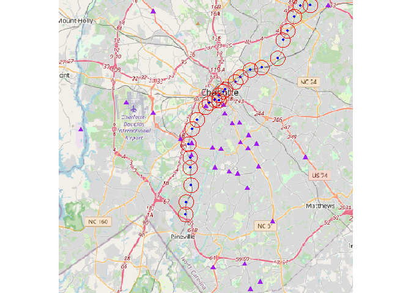

# Team Charlotte Weekly Report
Adi & David

## Research Question

What is the impact of particulate matter (PM2.5) and other environmental
factors on human health for individuals living in proximity to the Blue
Line light rail in Charlotte, North Carolina.

## Hypothesis

We hypothesize that:

1.  The concentration of PM2.5 is higher near the Blue Line light rail
    stations compared to areas further away.
2.  Proximity to major traffic intersections, industrial areas, power
    plants, and airports exacerbates the level of PM

## Context

- Area of study: Blue Lynx Light Rail, Charlotte, North Caroline

  - Table with corresponding above stations

    ``` r
    library("knitr")

    stations_table <- read.csv("new_station_coords_data.csv")
    kable(stations_table)
    ```

    | stations                               | Opening.Dates                                  | Parking |       lon |      lat | address                                                                 |     lat2 |      lon2 | address2                                                                |
    |:---------------------------------------|:-----------------------------------------------|:--------|----------:|---------:|:------------------------------------------------------------------------|---------:|----------:|:------------------------------------------------------------------------|
    | I-485/South Boulevard                  | November 24, 2007                              | TRUE    | -80.88292 | 35.10708 | i-485/south boulevard station, charlotte, nc 28134, usa                 | 35.10708 | -80.88292 | i-485/south boulevard station, charlotte, nc 28134, usa                 |
    | Sharon Road West station               | November 24, 2007                              | TRUE    | -80.88219 | 35.11927 | sharon road west station, charlotte, nc 28134, usa                      | 35.11927 | -80.88219 | sharon road west station, charlotte, nc 28134, usa                      |
    | Arrowood station                       | November 24, 2007                              | TRUE    | -80.87637 | 35.13569 | arrowood, 7717 england st, charlotte, nc 28273, usa                     | 35.13569 | -80.87637 | arrowood, 7717 england st, charlotte, nc 28273, usa                     |
    | Archdale station                       | November 24, 2007                              | TRUE    | -80.87748 | 35.15290 | archdale, charlotte, nc 28217, usa                                      | 35.15290 | -80.87748 | archdale, charlotte, nc 28217, usa                                      |
    | Tyvola station                         | November 24, 2007                              | TRUE    | -80.87750 | 35.16285 | tyvola, 5703 old pineville rd, charlotte, nc 28217, usa                 | 35.16285 | -80.87750 | tyvola, 5703 old pineville rd, charlotte, nc 28217, usa                 |
    | Woodlawn station (Charlotte)           | November 24, 2007                              | TRUE    | -80.87930 | 35.17590 | woodlawn station, charlotte, nc 28217, usa                              | 35.17590 | -80.87930 | woodlawn station, charlotte, nc 28217, usa                              |
    | Scaleybark station                     | November 24, 2007                              | FALSE   | -80.87501 | 35.19092 | scaleybark, charlotte, nc 28217, usa                                    | 35.19092 | -80.87501 | scaleybark, charlotte, nc 28217, usa                                    |
    | New Bern station                       | November 24, 2007                              | FALSE   | -80.86904 | 35.19985 | new bern station, charlotte, nc 28209, usa                              | 35.19985 | -80.86904 | new bern station, charlotte, nc 28209, usa                              |
    | East/West Boulevard station            | August 30, 1996 \| (rebuilt November 24, 2007) | FALSE   | -80.85895 | 35.21212 | east/west station, charlotte, nc 28203, usa                             | 35.21212 | -80.85895 | east/west station, charlotte, nc 28203, usa                             |
    | Bland Street station                   | August 30, 1996 \| (rebuilt November 24, 2007) | FALSE   | -80.85525 | 35.21582 | bland, charlotte, nc 28203, usa                                         | 35.21622 | -80.85446 | 1511 Camden Road, charlotte, nc, usa                                    |
    | Carson light rail station (Charlotte)  | November 24, 2007                              | FALSE   | -80.84313 | 35.22709 | charlotte, nc, usa                                                      | 35.21944 | -80.84823 | 218 East Carson Boulevard, charlotte, nc, usa                           |
    | Brooklyn Village (Charlotte)           | August 30, 1996 \| (rebuilt November 24, 2007) | FALSE   | -80.84299 | 35.21867 | e brooklyn vlg ave, charlotte, nc, usa                                  | 35.21867 | -80.84299 | e brooklyn vlg ave, charlotte, nc, usa                                  |
    | Third Street/Convention Center station | June 28, 2004 \| (rebuilt November 24, 2007)   | FALSE   | -80.84312 | 35.22375 | 3rd st./convention center, charlotte, nc 28244, usa                     | 35.22375 | -80.84312 | 3rd st./convention center, charlotte, nc 28244, usa                     |
    | Charlotte Transportation Center        | November 24, 2007                              | FALSE   | -80.84313 | 35.22709 | charlotte, nc, usa                                                      | 35.21944 | -80.84823 | 310 East Trade Street, charlotte, nc, usa                               |
    | 7th Street station (Charlotte)         | June 28, 2004 \| (rebuilt November 24, 2007)   | FALSE   | -80.83798 | 35.22751 | 7th st station, charlotte, nc 28202, usa                                | 35.22751 | -80.83798 | 7th st station, charlotte, nc 28202, usa                                |
    | 9th Street station (Charlotte)         | June 24, 2004 \| (rebuilt March 16, 2018)      | FALSE   | -80.83516 | 35.22948 | 239 e 9th st, charlotte, nc 28202, usa                                  | 35.22948 | -80.83516 | 239 e 9th st, charlotte, nc 28202, usa                                  |
    | Parkwood station                       | March 16, 2018                                 | FALSE   | -80.82323 | 35.23689 | parkwood, charlotte, nc 28206, usa                                      | 35.23689 | -80.82323 | parkwood, charlotte, nc 28206, usa                                      |
    | 25th Street station (Charlotte)        | March 16, 2018                                 | FALSE   | -80.81708 | 35.24174 | 25th street, charlotte, nc 28206, usa                                   | 35.24174 | -80.81708 | 25th street, charlotte, nc 28206, usa                                   |
    | 36th Street station (Charlotte)        | March 16, 2018                                 | FALSE   | -80.80545 | 35.24854 | 36th street station, charlotte, nc 28205, usa                           | 35.24854 | -80.80545 | 36th street station, charlotte, nc 28205, usa                           |
    | Sugar Creek station (Charlotte)        | March 16, 2018                                 | TRUE    | -80.79184 | 35.25106 | sugar creek station, bearwood ave, charlotte, nc 28205, usa             | 35.25106 | -80.79184 | sugar creek station, bearwood ave, charlotte, nc 28205, usa             |
    | Old Concord Road station               | March 16, 2018                                 | TRUE    | -80.77271 | 35.25996 | old concord road station, charlotte, nc 28213, usa                      | 35.25996 | -80.77271 | old concord road station, charlotte, nc 28213, usa                      |
    | Tom Hunter station                     | March 16, 2018                                 | FALSE   | -80.76629 | 35.27795 | tom hunter station, charlotte, nc 28213, usa                            | 35.27795 | -80.76629 | tom hunter station, charlotte, nc 28213, usa                            |
    | University City Blvd station           | March 16, 2018                                 | TRUE    | -80.76074 | 35.28692 | university city blvd, 7205 n tryon st, charlotte, nc 28262, usa         | 35.28692 | -80.76074 | university city blvd, 7205 n tryon st, charlotte, nc 28262, usa         |
    | McCullough station                     | March 16, 2018                                 | FALSE   | -80.75288 | 35.30112 | mccullough, 8312 n tryon st, charlotte, nc 28262, usa                   | 35.30112 | -80.75288 | mccullough, 8312 n tryon st, charlotte, nc 28262, usa                   |
    | JW Clay Blvd/UNC Charlotte station     | March 16, 2018                                 | TRUE    | -80.74503 | 35.31083 | 9234-9300 n tryon st, charlotte, nc 28262, usa                          | 35.31155 | -80.74547 | 9048 North Tryon Street, charlotte, nc, usa                             |
    | UNC Charlotte–Main station             | March 16, 2018                                 | FALSE   | -80.73371 | 35.31218 | unc charlotte main station, 9025 cameron blvd, charlotte, nc 28262, usa | 35.31218 | -80.73371 | unc charlotte main station, 9025 cameron blvd, charlotte, nc 28262, usa |

- Time Frame: November 2003 - November 2011

- Factors associated with PM2.5

  - Airport

  - Power Plant(s)

  - Factories

  - Major Intersection

    - Table with corresponding above factors

      ``` r
      factors_table <- read.csv("new_pm_coords_data.csv")
      kable(factors_table)
      ```

      | Type          | sources                                                 | Address                                                                | Reasons.                                                                                        |       lon |      lat | address                                                                                            |     lat2 |      lon2 | address2                                                                                           |
      |:--------------|:--------------------------------------------------------|:-----------------------------------------------------------------------|:------------------------------------------------------------------------------------------------|----------:|---------:|:---------------------------------------------------------------------------------------------------|---------:|----------:|:---------------------------------------------------------------------------------------------------|
      | Power Plant   | GG Allen steam station                                  | 253 Plant Allen Rd, Belmont, NC 28012                                  | Coal-fired power plant.                                                                         | -81.00855 | 35.18982 | 253 plant allen rd, belmont, nc 28012, usa                                                         | 35.18982 | -81.00855 | 253 plant allen rd, belmont, nc 28012, usa                                                         |
      | Neighbourhood | South End                                               | South End, Charlotte, NC 28203                                         | Once heavily industrial, still contains some light industrial facilities despite redevelopment. | -80.85878 | 35.21256 | south end, charlotte, nc 28203, usa                                                                | 35.21256 | -80.85878 | south end, charlotte, nc 28203, usa                                                                |
      | Airport       | Charlotte Douglas International Airport                 | 5501 Josh Birmingham Pkwy, Charlotte, NC 28208                         |                                                                                                 | -80.95395 | 35.21630 | charlotte douglas international airport (clt), 5501 josh birmingham pkwy, charlotte, nc 28208, usa | 35.21630 | -80.95395 | charlotte douglas international airport (clt), 5501 josh birmingham pkwy, charlotte, nc 28208, usa |
      | Intersection  | Ardrey Kell Rd Rea Rd                                   | Ardrey Kell Rd Rea Rd, Charlotte, NC                                   |                                                                                                 | -80.80554 | 35.03361 | ardrey kell rd & rea rd, charlotte, nc 28277, usa                                                  | 35.03361 | -80.80554 | ardrey kell rd & rea rd, charlotte, nc 28277, usa                                                  |
      | Intersection  | Ardrey Kell Rd Tom Short Rd                             | Ardrey Kell Rd Tom Short Rd, Charlotte, NC                             |                                                                                                 | -80.79392 | 35.04063 | ardrey kell rd & tom short rd, providence crossing, nc 28277, usa                                  | 35.04063 | -80.79392 | ardrey kell rd & tom short rd, providence crossing, nc 28277, usa                                  |
      | Intersection  | Back Creek Church Rd Pavilion Blvd University City Blvd | Back Creek Church Rd Pavilion Blvd University City Blvd, Charlotte, NC |                                                                                                 | -80.71236 | 35.31127 | pavilion blvd & university city blvd, charlotte, nc 28262, usa                                     | 35.31127 | -80.71236 | pavilion blvd & university city blvd, charlotte, nc 28262, usa                                     |
      | Intersection  | Ballantyne Commons Pkwy Johnston Rd                     | Ballantyne Commons Pkwy Johnston Rd, Charlotte, NC                     |                                                                                                 | -80.85015 | 35.05458 | ballantyne commons pkwy & johnston rd, charlotte, nc 28277, usa                                    | 35.05458 | -80.85015 | ballantyne commons pkwy & johnston rd, charlotte, nc 28277, usa                                    |
      | Intersection  | Ballantyne Commons Pkwy Rea Rd                          | Ballantyne Commons Pkwy Rea Rd, Charlotte, NC                          |                                                                                                 | -80.81236 | 35.05821 | ballantyne commons pkwy & rea rd, charlotte, nc 28277, usa                                         | 35.05821 | -80.81236 | ballantyne commons pkwy & rea rd, charlotte, nc 28277, usa                                         |
      | Intersection  | Billy Graham Pkwy S Tryon St Woodlawn Rd                | Billy Graham Pkwy S Tryon St Woodlawn Rd, Charlotte, NC                |                                                                                                 | -80.88929 | 35.18067 | s tryon st & billy graham pkwy, charlotte, nc 28217, usa                                           | 35.18067 | -80.88929 | s tryon st & billy graham pkwy, charlotte, nc 28217, usa                                           |
      | Intersection  | Billy Graham Pkwy West Bv                               | Billy Graham Pkwy West Bv, Charlotte, NC                               |                                                                                                 | -80.92205 | 35.20614 | billy graham pkwy & west blvd, charlotte, nc 28208, usa                                            | 35.20614 | -80.92205 | billy graham pkwy & west blvd, charlotte, nc 28208, usa                                            |
      | Intersection  | Brookshire Blvd Mt Holly Huntersville Rd                | Brookshire Blvd Mt Holly Huntersville Rd, Charlotte, NC                |                                                                                                 | -80.94522 | 35.32554 | brookshire blvd & mt holly-huntersville rd, charlotte, nc 28216, usa                               | 35.32554 | -80.94522 | brookshire blvd & mt holly-huntersville rd, charlotte, nc 28216, usa                               |
      | Intersection  | Carmel Rd Colony Rd                                     | Carmel Rd Colony Rd, Charlotte, NC                                     |                                                                                                 | -80.80911 | 35.13259 | colony rd & carmel rd, charlotte, nc 28226, usa                                                    | 35.13259 | -80.80911 | colony rd & carmel rd, charlotte, nc 28226, usa                                                    |
      | Intersection  | Charlottetowne Av I-277 OL Ramp Kenilworth Av           | Charlottetowne Av I-277 OL Ramp Kenilworth Av, Charlotte, NC           |                                                                                                 |        NA |       NA | NA                                                                                                 | 35.21393 | -80.83748 | Charlottetowne Av I-277 OL Ramp Kenilworth Av, Charlotte, NC                                       |
      | Intersection  | Colony Rd Fairview Rd                                   | Colony Rd Fairview Rd, Charlotte, NC                                   |                                                                                                 | -80.82097 | 35.14655 | fairview rd, charlotte, nc, usa                                                                    | 35.14655 | -80.82097 | fairview rd, charlotte, nc, usa                                                                    |
      | Intersection  | Colville Rd Laurel Av Randolph Rd                       | Colville Rd Laurel Av Randolph Rd, Charlotte, NC                       |                                                                                                 | -80.81838 | 35.19667 | colville rd, charlotte, nc 28207, usa                                                              | 35.19667 | -80.81838 | colville rd, charlotte, nc 28207, usa                                                              |
      | Intersection  | Fairview Rd Park Road Tyvola Rd                         | Fairview Rd Park Road Tyvola Rd, Charlotte, NC                         |                                                                                                 | -80.84779 | 35.15262 | fairview rd & park rd, charlotte, nc 28210, usa                                                    | 35.15262 | -80.84779 | fairview rd & park rd, charlotte, nc 28210, usa                                                    |
      | Intersection  | Fairview Rd Providence Rd Sardis Rd                     | Fairview Rd Providence Rd Sardis Rd, Charlotte, NC                     |                                                                                                 | -80.79561 | 35.15381 | fairview rd & providence rd, charlotte, nc 28211, usa                                              | 35.15381 | -80.79561 | fairview rd & providence rd, charlotte, nc 28211, usa                                              |
      | Intersection  | Fairview Rd Sharon Rd                                   | Fairview Rd Sharon Rd, Charlotte, NC                                   |                                                                                                 | -80.83079 | 35.14849 | fairview rd & sharon rd, charlotte, nc 28210, usa                                                  | 35.14849 | -80.83079 | fairview rd & sharon rd, charlotte, nc 28210, usa                                                  |
      | Intersection  | I-85 Ramps Brookshire Blvd                              | I-85 Ramps Brookshire Blvd, Charlotte, NC                              |                                                                                                 | -80.92187 | 35.30571 | brookshire blvd, north carolina, usa                                                               | 35.30571 | -80.92187 | brookshire blvd, north carolina, usa                                                               |
      | Intersection  | Independence Blvd Village Lake Dr                       | Independence Blvd Village Lake Dr, Charlotte, NC                       |                                                                                                 | -80.73939 | 35.16268 | e independence blvd & village lake dr, charlotte, nc 28227, usa                                    | 35.16268 | -80.73939 | e independence blvd & village lake dr, charlotte, nc 28227, usa                                    |
      | Intersection  | Kings Dr Morehead St                                    | Kings Dr Morehead St, Charlotte, NC                                    |                                                                                                 | -80.83608 | 35.20548 | kings dr & morehead st, charlotte, nc 28204, usa                                                   | 35.20548 | -80.83608 | kings dr & morehead st, charlotte, nc 28204, usa                                                   |
      | Intersection  | Park Rd Woodlawn Rd                                     | Park Rd Woodlawn Rd, Charlotte, NC                                     |                                                                                                 | -80.85109 | 35.17205 | park rd & woodlawn rd, charlotte, nc 28209, usa                                                    | 35.17205 | -80.85109 | park rd & woodlawn rd, charlotte, nc 28209, usa                                                    |
      | Intersection  | Pineville-Matthews Rd Providence Rd                     | Pineville-Matthews Rd Providence Rd, Charlotte, NC                     |                                                                                                 | -80.77880 | 35.09993 | providence rd & pineville-matthews rd, charlotte, nc 28277, usa                                    | 35.09993 | -80.77880 | providence rd & pineville-matthews rd, charlotte, nc 28277, usa                                    |
      | Intersection  | Providence Rd Queens Rd                                 | Providence Rd Queens Rd, Charlotte, NC                                 |                                                                                                 |        NA |       NA | NA                                                                                                 | 35.19589 | -80.82715 | Providence Rd Queens Rd, Charlotte, NC                                                             |
      | Intersection  | Providence Rd Sharon Amity Rd                           | Providence Rd Sharon Amity Rd, Charlotte, NC                           |                                                                                                 | -80.80826 | 35.17134 | providence rd & s sharon amity rd, charlotte, nc 28211, usa                                        | 35.17134 | -80.80826 | providence rd & s sharon amity rd, charlotte, nc 28211, usa                                        |
      | Intersection  | Providence Rd Wendover Rd                               | Providence Rd Wendover Rd, Charlotte, NC                               |                                                                                                 | -80.81747 | 35.17740 | providence rd & s wendover rd, charlotte, nc 28211, usa                                            | 35.17740 | -80.81747 | providence rd & s wendover rd, charlotte, nc 28211, usa                                            |
      | Intersection  | Randolph Rd Sharon Amity Rd                             | Randolph Rd Sharon Amity Rd, Charlotte, NC                             |                                                                                                 | -80.79823 | 35.17594 | randolph rd & s sharon amity rd, charlotte, nc 28211, usa                                          | 35.17594 | -80.79823 | randolph rd & s sharon amity rd, charlotte, nc 28211, usa                                          |
      | Intersection  | Randolph Rd Wendover Rd                                 | Randolph Rd Wendover Rd, Charlotte, NC                                 |                                                                                                 | -80.80757 | 35.18421 | n wendover rd & randolph rd, charlotte, nc 28211, usa                                              | 35.18421 | -80.80757 | n wendover rd & randolph rd, charlotte, nc 28211, usa                                              |
      | Intersection  | Runnymede Ln Selwyn Av Woodlawn Rd                      | Runnymede Ln Selwyn Av Woodlawn Rd, Charlotte, NC                      |                                                                                                 | -80.84076 | 35.17083 | runnymede ln & selwyn ave, charlotte, nc 28209, usa                                                | 35.17083 | -80.84076 | runnymede ln & selwyn ave, charlotte, nc 28209, usa                                                |
      | Intersection  | South Blvd Tyvola Rd                                    | South Blvd Tyvola Rd, Charlotte, NC                                    |                                                                                                 | -80.87604 | 35.16482 | tyvola rd & south blvd, charlotte, nc 28210, usa                                                   | 35.16482 | -80.87604 | tyvola rd & south blvd, charlotte, nc 28210, usa                                                   |
      | Intersection  | South Blvd Woodlawn Rd                                  | South Blvd Woodlawn Rd, Charlotte, NC                                  |                                                                                                 | -80.87582 | 35.17653 | e woodlawn rd & south blvd, charlotte, nc 28209, usa                                               | 35.17653 | -80.87582 | e woodlawn rd & south blvd, charlotte, nc 28209, usa                                               |

## Running Code

### Installing Packages

``` r
# install.packages("tidyverse")
# install.packages("ggmap")
# install.packages("maptiles")
# install.packages("terra")
# install.packages("leaflet")
```

### Loading Libraries

``` r
library("tidyverse")
```

    ── Attaching core tidyverse packages ──────────────────────── tidyverse 2.0.0 ──
    ✔ dplyr     1.1.4     ✔ readr     2.1.5
    ✔ forcats   1.0.0     ✔ stringr   1.5.1
    ✔ ggplot2   3.4.4     ✔ tibble    3.2.1
    ✔ lubridate 1.9.3     ✔ tidyr     1.3.1
    ✔ purrr     1.0.2     
    ── Conflicts ────────────────────────────────────────── tidyverse_conflicts() ──
    ✖ dplyr::filter() masks stats::filter()
    ✖ dplyr::lag()    masks stats::lag()
    ℹ Use the conflicted package (<http://conflicted.r-lib.org/>) to force all conflicts to become errors

``` r
library("ggmap")
```

    ℹ Google's Terms of Service: <https://mapsplatform.google.com>
      Stadia Maps' Terms of Service: <https://stadiamaps.com/terms-of-service/>
      OpenStreetMap's Tile Usage Policy: <https://operations.osmfoundation.org/policies/tiles/>
    ℹ Please cite ggmap if you use it! Use `citation("ggmap")` for details.

``` r
library("terra")
```

    Warning: package 'terra' was built under R version 4.3.3

    terra 1.7.78

    Attaching package: 'terra'

    The following object is masked from 'package:ggmap':

        inset

    The following object is masked from 'package:tidyr':

        extract

    The following object is masked from 'package:knitr':

        spin

``` r
library("maptiles")
library("leaflet")
```

### Gathering Data using Google API

GitHub doesn’t allow to publicly release the API into README. Use the
“geocoded_data.csv” to refer the data requested from API

### Cleaning Data

``` r
addrs.geo <- read.csv("geocoded_data.csv")
new_addr <- addrs.geo %>% 
  mutate(
    lat2 = ifelse(
      stations == "Bland Street station", 
      35.21622, 
      lat
    ), 
    lon2 = ifelse(
      stations == "Bland Street station", 
      -80.85446, 
      lon
    ),
    address2 = ifelse(
      stations == "Bland Street station", 
      "1511 Camden Road, charlotte, nc, usa", address
      
    )
  ) %>% 
  mutate(
    lat2 = ifelse(
      stations == "Carson light rail station (Charlotte)", 
      35.21944, 
      lat2
    ), 
    lon2 = ifelse(
      stations == "Carson light rail station (Charlotte)", 
      -80.84823, 
      lon2
    ),
    address2 = ifelse(
      stations == "Carson light rail station (Charlotte)", 
      "218 East Carson Boulevard, charlotte, nc, usa",
      address2
    )
  ) %>% 
  mutate(
    lat2 = ifelse(
      stations == "Charlotte Transportation Center", 
      35.21944, 
      lat2
    ), 
    lon2 = ifelse(
      stations == "Charlotte Transportation Center", 
      -80.84823, 
      lon2
    ),
    address2 = ifelse(
      stations == "Charlotte Transportation Center", 
      "310 East Trade Street, charlotte, nc, usa", address2 
    )
  ) %>% 
  
  
  mutate(
    lat2 = ifelse(
      stations == "JW Clay Blvd/UNC Charlotte station", 
      35.31155, 
      lat2
    ), 
    lon2 = ifelse(
      stations == "JW Clay Blvd/UNC Charlotte station", 
      -80.74547, 
      lon2
    ),
    address2 = ifelse(
      stations == "JW Clay Blvd/UNC Charlotte station", 
      "9048 North Tryon Street, charlotte, nc, usa", address2 
    )
  )
```

### Storing Data into new CSV File

``` r
# First time users - do NOT over-wrrite CSV file
# write.csv(new_addr, "new_station_coords_data.csv", row.names = FALSE)
```

### Storing Latitude and Longtitude

``` r
sample_latlon <- cbind(new_addr$lon2, new_addr$lat2)
sample_latlon
```

               [,1]     [,2]
     [1,] -80.88292 35.10708
     [2,] -80.88219 35.11927
     [3,] -80.87637 35.13569
     [4,] -80.87748 35.15290
     [5,] -80.87750 35.16285
     [6,] -80.87930 35.17590
     [7,] -80.87501 35.19092
     [8,] -80.86904 35.19985
     [9,] -80.85895 35.21212
    [10,] -80.85446 35.21622
    [11,] -80.84823 35.21944
    [12,] -80.84299 35.21867
    [13,] -80.84312 35.22375
    [14,] -80.84823 35.21944
    [15,] -80.83798 35.22751
    [16,] -80.83516 35.22948
    [17,] -80.82323 35.23689
    [18,] -80.81708 35.24174
    [19,] -80.80545 35.24854
    [20,] -80.79184 35.25106
    [21,] -80.77271 35.25996
    [22,] -80.76629 35.27795
    [23,] -80.76074 35.28692
    [24,] -80.75288 35.30112
    [25,] -80.74547 35.31155
    [26,] -80.73371 35.31218

### Storing into Vector Data

``` r
pts <-  vect(sample_latlon)
crdref <- "+proj=longlat +datum=WGS84"
pts <- vect(sample_latlon, crs=crdref)
plot(pts)
```


``` r
crs(pts)
```

    [1] "GEOGCRS[\"unknown\",\n    DATUM[\"World Geodetic System 1984\",\n        ELLIPSOID[\"WGS 84\",6378137,298.257223563,\n            LENGTHUNIT[\"metre\",1]],\n        ID[\"EPSG\",6326]],\n    PRIMEM[\"Greenwich\",0,\n        ANGLEUNIT[\"degree\",0.0174532925199433],\n        ID[\"EPSG\",8901]],\n    CS[ellipsoidal,2],\n        AXIS[\"longitude\",east,\n            ORDER[1],\n            ANGLEUNIT[\"degree\",0.0174532925199433,\n                ID[\"EPSG\",9122]]],\n        AXIS[\"latitude\",north,\n            ORDER[2],\n            ANGLEUNIT[\"degree\",0.0174532925199433,\n                ID[\"EPSG\",9122]]]]"

### Plotting Station Coordinates

``` r
point_map <- vect(sample_latlon, type="points", crs = crdref)
point_map
```

     class       : SpatVector 
     geometry    : points 
     dimensions  : 26, 0  (geometries, attributes)
     extent      : -80.88292, -80.73371, 35.10708, 35.31218  (xmin, xmax, ymin, ymax)
     coord. ref. : +proj=longlat +datum=WGS84 +no_defs 

``` r
plot(point_map)
```


``` r
pols <- vect(sample_latlon, type="polygons", crs = crdref)
pols
```

     class       : SpatVector 
     geometry    : polygons 
     dimensions  : 1, 0  (geometries, attributes)
     extent      : -80.88292, -80.73371, 35.10708, 35.31218  (xmin, xmax, ymin, ymax)
     coord. ref. : +proj=longlat +datum=WGS84 +no_defs 

``` r
plot(pols)
```



``` r
plot(pols, border="blue", col="yellow", lwd=2)
# pch = plot charater = 20 - circle 
# cex = charater expansion
points(x = pts, col="red", pch = 20, cex = 1)
```


### Overlaying Stations with PM2.5

``` r
# Plot Stations
x <- vect(sample_latlon, crs = "+proj=longlat +ellps=WGS84 +datum=WGS84 +no_defs")
plot(x)
```


``` r
# Plot Factors
pm_sources <- vect("/Users/paditya9/teamCharlotte/PM2.5 ShapeFiles/new_pm_coords_sources.shp")
plot(pm_sources)
```


``` r
# Plot Buffer around stations
# Target Buffer Radius =  800 meters
pts_buffer <- buffer(x, width = 800)
plot(pts_buffer)
```


``` r
# Creating Buffer for Map
extent<-buffer(x, width = 200)

bg <- get_tiles(ext(extent), zoom = 11)

plot(bg)

# pch=19 gives filled circles
points(x, col="blue", pch=19, cex=0.5)

# pch=17 gives filled triangles
points(pm_sources, col="purple", pch=17, cex=1)

# Plot the buffer around the stations
lines(pts_buffer, col="red")
```


### Saving the Buffer’s into ShapeFile

``` r
# First time users - do NOT over-wrrite CSV file
# writeVector(pts_buffer, "new_buffer_light_rail.shp")
```

### Combining PM2.5 Daily Data

``` r
# List all CSV files in the directory
file_list <- list.files(path = "PM25_daily", pattern = "*.csv", full.names = TRUE)

# Read and combine all CSV files into one data frame
combined_df <- do.call(rbind, lapply(file_list, function(file) {
  df <- read.csv(file)
  # Assuming your date column is named 'date' and is in format '%Y%m%d'
  df$date <- as.Date(df$date, format = "%Y%m%d")
  df
}))

# Filter rows from 2003-11-24 to 2011-11-24
combined_df_filtered <- combined_df %>%
  filter(date >= as.Date("2003-11-24") & date <= as.Date("2011-11-24"))

# Write the filtered data frame to a new CSV file
write.csv(combined_df_filtered, "refined_PM25_daily_combined_data.csv", row.names = FALSE)

PM_25_with_date <- read.csv("refined_PM25_daily_combined_data.csv")

PM_25_with_date <- PM_25_with_date %>%
   mutate(formatted_date = paste(substr(date, 1, 4), substr(date, 6, 7), substr(date, 9, 10), sep = "-")) %>% mutate(station_ID = PM_25_with_date$city_num )

# First time users - do NOT over-wrrite CSV file
# write.csv(PM_25_with_date, "refined_date_PM25_daily_data.csv")
```

### Creating Station ID

``` r
stations_coords <- read.csv("/Users/paditya9/teamCharlotte/new_station_coords_data.csv")

stations_coords <- stations_coords %>% mutate(station_ID = row_number())

# First time users - do NOT over-wrrite CSV file
# write.csv(stations_coords, "station_coords_with_stationID_data.csv", row.names = F)
```

### Creating Holiday Data

``` r
holidays_data <- read.csv("/Users/paditya9/teamCharlotte/major_holidays_2000_2025.csv", header = TRUE, stringsAsFactors = FALSE)

holidays_data <- holidays_data %>% filter(date >= as.Date("2003-11-24") & date <= as.Date("2011-11-24")) %>% mutate(formatted_date = date)

# First time users - do NOT over-wrrite CSV file
# write.csv(holidays_data, "refined_holidays_data.csv", row.names = F)
```

### Cumulative Data

This code chunk combines various data frames into a single data frame,
emphasizing code re usability and avoiding complexity. It integrates
data from below CSV files

1.  Stations Data
2.  PM2.5 measurements Data
3.  Meteorological Data
4.  Holidays Data

``` r
#Reading Stations Data
stationID_data <- read.csv("station_coords_with_stationID_data.csv", header = TRUE, stringsAsFactors = FALSE)[, c("stations", "station_ID", "address2")]

#Reading PM2.5 Daily Data
pm_25_data <- read.csv("refined_date_PM25_daily_data.csv", header = TRUE, stringsAsFactors = FALSE)[, c("station_ID", "formatted_date", "pm25")]

#Reading Meterological Data
met_data <- read.csv("met_data_charlotte/combinedMeteorologyDataCharlotte.csv", header = TRUE, stringsAsFactors = FALSE)[, c("Tair_f_tavg", "Wind_f_tavg", "Qair_f_tavg", "formatted_date")]

#Reading Holiday Data
holidays_data <- read.csv("/Users/paditya9/teamCharlotte/refined_holidays_data.csv", header = TRUE, stringsAsFactors = FALSE)[, c("holiday", "formatted_date")]

station_pm_met_dataCombined <- merge(stationID_data,pm_25_data, by="station_ID", all = F )

station_pm_met_dataCombined <- merge(station_pm_met_dataCombined, met_data, by="formatted_date", all = F)

station_pm_met_holiday_dataCombined <- station_pm_met_dataCombined %>% left_join(holidays_data, by = "formatted_date", keep = FALSE, unmatched = "drop")
```

    Warning in left_join(., holidays_data, by = "formatted_date", keep = FALSE, : Detected an unexpected many-to-many relationship between `x` and `y`.
    ℹ Row 59125 of `x` matches multiple rows in `y`.
    ℹ Row 1 of `y` matches multiple rows in `x`.
    ℹ If a many-to-many relationship is expected, set `relationship =
      "many-to-many"` to silence this warning.

``` r
# Ordering the list by date followed by station ID
station_pm_met_holiday_dataCombined_order <- station_pm_met_holiday_dataCombined[order(station_pm_met_holiday_dataCombined$formatted_date, station_pm_met_holiday_dataCombined$station_ID), ]

# %B is used for abbrevation for Month 
station_pm_met_holiday_dataCombined_formatted <- station_pm_met_holiday_dataCombined_order %>%
  mutate(month = format(as.Date(station_pm_met_holiday_dataCombined_order$formatted_date, format = "%Y-%m-%d"), "%B")) %>% 
  mutate (day_of_week = weekdays(as.Date(station_pm_met_holiday_dataCombined_order$formatted_date, format = "%Y-%m-%d"))) %>% 
# NA = 0; Holiday = 1
  mutate(holiday_binary = ifelse(is.na(holiday), 0, 1))

# First time users - do NOT over-wrrite CSV file
# write_csv(station_pm_met_holiday_dataCombined_formatted, "station_pm_met_holiday_dataCombined_formatted.csv")
```

``` r
combinedData <- read.csv("station_pm_met_holiday_dataCombined_formatted.csv")

# No PM sources = 0; PM Source near Station = 1
binaryPMFactor <- combinedData %>% 
  mutate(PMFactor = ifelse(
    station_ID %in% c(5, 6, 9, 10), 1, 0
  ))

# write.csv(binaryPMFactor, "station_pm_met_holiday_dataCombined_formatted.csv" )
```

### Adding Binary Column for PM Factor’s

``` r
combinedData_table <- read.csv("station_pm_met_holiday_dataCombined_formatted.csv")
head(combinedData_table) %>%
  kable()
```

|   X | formatted_date | station_ID | stations                     | address2                                                |     pm25 | Tair_f_tavg | Wind_f_tavg | Qair_f_tavg | holiday | month    | day_of_week | holiday_binary | PMFactor |
|----:|:---------------|-----------:|:-----------------------------|:--------------------------------------------------------|---------:|------------:|------------:|------------:|:--------|:---------|:------------|---------------:|---------:|
|   1 | 2003-11-24     |          1 | I-485/South Boulevard        | i-485/south boulevard station, charlotte, nc 28134, usa | 10.70957 |    288.6281 |    5.050052 |   0.0097345 | NA      | November | Monday      |              0 |        0 |
|   2 | 2003-11-24     |          2 | Sharon Road West station     | sharon road west station, charlotte, nc 28134, usa      | 10.95833 |    288.6281 |    5.050052 |   0.0097345 | NA      | November | Monday      |              0 |        0 |
|   3 | 2003-11-24     |          3 | Arrowood station             | arrowood, 7717 england st, charlotte, nc 28273, usa     | 10.23755 |    288.6281 |    5.050052 |   0.0097345 | NA      | November | Monday      |              0 |        0 |
|   4 | 2003-11-24     |          4 | Archdale station             | archdale, charlotte, nc 28217, usa                      | 11.35159 |    288.6281 |    5.050052 |   0.0097345 | NA      | November | Monday      |              0 |        0 |
|   5 | 2003-11-24     |          5 | Tyvola station               | tyvola, 5703 old pineville rd, charlotte, nc 28217, usa | 10.90818 |    288.6281 |    5.050052 |   0.0097345 | NA      | November | Monday      |              0 |        1 |
|   6 | 2003-11-24     |          6 | Woodlawn station (Charlotte) | woodlawn station, charlotte, nc 28217, usa              | 10.76754 |    288.6281 |    5.050052 |   0.0097345 | NA      | November | Monday      |              0 |        1 |

### Regression Model Calculation

``` r
df <-read.csv("station_pm_met_holiday_dataCombined_formatted.csv")

df2 <- df %>% mutate(date = as.Date(formatted_date,format = "%Y-%m-%d"))

startdate <- as.Date("2003-11-24",format = "%Y-%m-%d")

enddate <- as.Date("2011-11-24",format = "%Y-%m-%d")

opendate <- as.Date("2007-11-24",format = "%Y-%m-%d")

constructionstart <- as.Date("2005-02-26",format = "%Y-%m-%d")

metroOpen_df <- df2 %>% filter(date >= startdate & date<=enddate)%>%
  mutate(MetroOpen = ifelse(date>=opendate,1,0))%>%
  mutate(construction = ifelse(date>=constructionstart & date<opendate,1,0))%>%
  
  group_by(station_ID)%>%
  arrange(station_ID,date)%>%
  mutate(lTair_f_tavg = lag(Tair_f_tavg))%>%
  mutate(t=as.numeric(date-startdate))%>%
  mutate(t2 = t^2,t3=t^3,t4=t^4)

summary(m1 <- lm(log(pm25)~MetroOpen,data = metroOpen_df))
```


    Call:
    lm(formula = log(pm25) ~ MetroOpen, data = metroOpen_df)

    Residuals:
         Min       1Q   Median       3Q      Max 
    -2.66092 -0.32877  0.04632  0.37015  1.28279 

    Coefficients:
                 Estimate Std. Error t value Pr(>|t|)    
    (Intercept)  2.555221   0.002570   994.2   <2e-16 ***
    MetroOpen   -0.257993   0.003633   -71.0   <2e-16 ***
    ---
    Signif. codes:  0 '***' 0.001 '**' 0.01 '*' 0.05 '.' 0.1 ' ' 1

    Residual standard error: 0.5009 on 76022 degrees of freedom
    Multiple R-squared:  0.06219,   Adjusted R-squared:  0.06218 
    F-statistic:  5042 on 1 and 76022 DF,  p-value: < 2.2e-16

``` r
summary(m1 <- lm(log(pm25)~MetroOpen+construction+as.factor(day_of_week)+as.factor(month),data = metroOpen_df))
```


    Call:
    lm(formula = log(pm25) ~ MetroOpen + construction + as.factor(day_of_week) + 
        as.factor(month), data = metroOpen_df)

    Residuals:
         Min       1Q   Median       3Q      Max 
    -2.45738 -0.30369  0.03379  0.33541  1.40563 

    Coefficients:
                                      Estimate Std. Error t value Pr(>|t|)    
    (Intercept)                      2.4472587  0.0082507 296.614  < 2e-16 ***
    MetroOpen                       -0.3042744  0.0049020 -62.072  < 2e-16 ***
    construction                    -0.0677965  0.0051966 -13.046  < 2e-16 ***
    as.factor(day_of_week)Monday    -0.0135677  0.0063064  -2.151  0.03145 *  
    as.factor(day_of_week)Saturday   0.0180442  0.0063096   2.860  0.00424 ** 
    as.factor(day_of_week)Sunday    -0.0047160  0.0063061  -0.748  0.45456    
    as.factor(day_of_week)Thursday   0.0201101  0.0063059   3.189  0.00143 ** 
    as.factor(day_of_week)Tuesday    0.0214776  0.0063065   3.406  0.00066 ***
    as.factor(day_of_week)Wednesday  0.0325254  0.0063062   5.158 2.51e-07 ***
    as.factor(month)August           0.4719648  0.0082501  57.207  < 2e-16 ***
    as.factor(month)December         0.0336898  0.0082750   4.071 4.68e-05 ***
    as.factor(month)February         0.0527342  0.0084557   6.237 4.50e-10 ***
    as.factor(month)January         -0.0102303  0.0082751  -1.236  0.21636    
    as.factor(month)July             0.4706523  0.0082494  57.053  < 2e-16 ***
    as.factor(month)June             0.3936369  0.0083170  47.329  < 2e-16 ***
    as.factor(month)March            0.0179714  0.0082499   2.178  0.02938 *  
    as.factor(month)May              0.1650286  0.0082499  20.004  < 2e-16 ***
    as.factor(month)November        -0.0001373  0.0083100  -0.017  0.98682    
    as.factor(month)October         -0.0478914  0.0082496  -5.805 6.45e-09 ***
    as.factor(month)September        0.1703781  0.0083168  20.486  < 2e-16 ***
    ---
    Signif. codes:  0 '***' 0.001 '**' 0.01 '*' 0.05 '.' 0.1 ' ' 1

    Residual standard error: 0.4645 on 76004 degrees of freedom
    Multiple R-squared:  0.1936,    Adjusted R-squared:  0.1934 
    F-statistic: 960.6 on 19 and 76004 DF,  p-value: < 2.2e-16

``` r
summary(m1 <- lm(log(pm25)~MetroOpen+construction+as.factor(day_of_week)+as.factor(month) + Tair_f_tavg,data = metroOpen_df))
```


    Call:
    lm(formula = log(pm25) ~ MetroOpen + construction + as.factor(day_of_week) + 
        as.factor(month) + Tair_f_tavg, data = metroOpen_df)

    Residuals:
         Min       1Q   Median       3Q      Max 
    -2.46759 -0.29451  0.03614  0.32690  1.39161 

    Coefficients:
                                      Estimate Std. Error t value Pr(>|t|)    
    (Intercept)                     -1.3388331  0.1296629 -10.325  < 2e-16 ***
    MetroOpen                       -0.3062187  0.0048751 -62.813  < 2e-16 ***
    construction                    -0.0697845  0.0051681 -13.503  < 2e-16 ***
    as.factor(day_of_week)Monday    -0.0144690  0.0062713  -2.307  0.02105 *  
    as.factor(day_of_week)Saturday   0.0191021  0.0062745   3.044  0.00233 ** 
    as.factor(day_of_week)Sunday    -0.0049692  0.0062709  -0.792  0.42812    
    as.factor(day_of_week)Thursday   0.0181214  0.0062711   2.890  0.00386 ** 
    as.factor(day_of_week)Tuesday    0.0190336  0.0062719   3.035  0.00241 ** 
    as.factor(day_of_week)Wednesday  0.0324510  0.0062711   5.175 2.29e-07 ***
    as.factor(month)August           0.3419152  0.0093308  36.644  < 2e-16 ***
    as.factor(month)December         0.1651216  0.0093752  17.613  < 2e-16 ***
    as.factor(month)February         0.1767097  0.0094159  18.767  < 2e-16 ***
    as.factor(month)January          0.1288645  0.0095035  13.560  < 2e-16 ***
    as.factor(month)July             0.3382664  0.0093685  36.107  < 2e-16 ***
    as.factor(month)June             0.2761513  0.0091939  30.036  < 2e-16 ***
    as.factor(month)March            0.0788110  0.0084634   9.312  < 2e-16 ***
    as.factor(month)May              0.1085674  0.0084278  12.882  < 2e-16 ***
    as.factor(month)November         0.0671734  0.0085779   7.831 4.90e-15 ***
    as.factor(month)October         -0.0506612  0.0082042  -6.175 6.65e-10 ***
    as.factor(month)September        0.0852651  0.0087671   9.726  < 2e-16 ***
    Tair_f_tavg                      0.0130954  0.0004476  29.258  < 2e-16 ***
    ---
    Signif. codes:  0 '***' 0.001 '**' 0.01 '*' 0.05 '.' 0.1 ' ' 1

    Residual standard error: 0.462 on 76003 degrees of freedom
    Multiple R-squared:  0.2026,    Adjusted R-squared:  0.2024 
    F-statistic: 965.7 on 20 and 76003 DF,  p-value: < 2.2e-16

``` r
summary(m1 <- lm(log(pm25)~MetroOpen+construction+as.factor(day_of_week)+as.factor(month) + Tair_f_tavg + Wind_f_tavg,data = metroOpen_df))
```


    Call:
    lm(formula = log(pm25) ~ MetroOpen + construction + as.factor(day_of_week) + 
        as.factor(month) + Tair_f_tavg + Wind_f_tavg, data = metroOpen_df)

    Residuals:
         Min       1Q   Median       3Q      Max 
    -2.52876 -0.26850  0.02632  0.28418  1.25081 

    Coefficients:
                                      Estimate Std. Error  t value Pr(>|t|)    
    (Intercept)                     -0.2931083  0.1185021   -2.473 0.013384 *  
    MetroOpen                       -0.3037555  0.0044443  -68.348  < 2e-16 ***
    construction                    -0.0741550  0.0047114  -15.739  < 2e-16 ***
    as.factor(day_of_week)Monday    -0.0241907  0.0057176   -4.231 2.33e-05 ***
    as.factor(day_of_week)Saturday   0.0042401  0.0057212    0.741 0.458627    
    as.factor(day_of_week)Sunday    -0.0160511  0.0057174   -2.807 0.004995 ** 
    as.factor(day_of_week)Thursday   0.0056676  0.0057177    0.991 0.321572    
    as.factor(day_of_week)Tuesday    0.0203711  0.0057176    3.563 0.000367 ***
    as.factor(day_of_week)Wednesday  0.0369449  0.0057169    6.462 1.04e-10 ***
    as.factor(month)August           0.0708455  0.0087812    8.068 7.26e-16 ***
    as.factor(month)December         0.2237589  0.0085596   26.141  < 2e-16 ***
    as.factor(month)February         0.2673328  0.0086146   31.033  < 2e-16 ***
    as.factor(month)January          0.2275303  0.0086999   26.153  < 2e-16 ***
    as.factor(month)July             0.0859334  0.0087784    9.789  < 2e-16 ***
    as.factor(month)June             0.0450885  0.0085850    5.252 1.51e-07 ***
    as.factor(month)March            0.1306480  0.0077266   16.909  < 2e-16 ***
    as.factor(month)May             -0.0149398  0.0077470   -1.928 0.053799 .  
    as.factor(month)November         0.0469572  0.0078215    6.004 1.94e-09 ***
    as.factor(month)October         -0.1605121  0.0075311  -21.313  < 2e-16 ***
    as.factor(month)September       -0.1008717  0.0081313  -12.405  < 2e-16 ***
    Tair_f_tavg                      0.0117616  0.0004082   28.816  < 2e-16 ***
    Wind_f_tavg                     -0.1895311  0.0015247 -124.307  < 2e-16 ***
    ---
    Signif. codes:  0 '***' 0.001 '**' 0.01 '*' 0.05 '.' 0.1 ' ' 1

    Residual standard error: 0.4211 on 76002 degrees of freedom
    Multiple R-squared:  0.3374,    Adjusted R-squared:  0.3372 
    F-statistic:  1842 on 21 and 76002 DF,  p-value: < 2.2e-16

``` r
summary(m1 <- lm(log(pm25)~MetroOpen+construction+as.factor(day_of_week)+as.factor(month) + Tair_f_tavg + Wind_f_tavg+Qair_f_tavg,data = metroOpen_df))
```


    Call:
    lm(formula = log(pm25) ~ MetroOpen + construction + as.factor(day_of_week) + 
        as.factor(month) + Tair_f_tavg + Wind_f_tavg + Qair_f_tavg, 
        data = metroOpen_df)

    Residuals:
         Min       1Q   Median       3Q      Max 
    -2.54699 -0.26935  0.02629  0.28336  1.25333 

    Coefficients:
                                      Estimate Std. Error  t value Pr(>|t|)    
    (Intercept)                      1.3447837  0.2301784    5.842 5.17e-09 ***
    MetroOpen                       -0.3020947  0.0044468  -67.936  < 2e-16 ***
    construction                    -0.0708077  0.0047266  -14.981  < 2e-16 ***
    as.factor(day_of_week)Monday    -0.0229720  0.0057169   -4.018 5.87e-05 ***
    as.factor(day_of_week)Saturday   0.0045141  0.0057188    0.789 0.429908    
    as.factor(day_of_week)Sunday    -0.0156870  0.0057150   -2.745 0.006055 ** 
    as.factor(day_of_week)Thursday   0.0049815  0.0057157    0.872 0.383462    
    as.factor(day_of_week)Tuesday    0.0207618  0.0057152    3.633 0.000281 ***
    as.factor(day_of_week)Wednesday  0.0379634  0.0057157    6.642 3.12e-11 ***
    as.factor(month)August           0.0350694  0.0097788    3.586 0.000336 ***
    as.factor(month)December         0.2078500  0.0087679   23.706  < 2e-16 ***
    as.factor(month)February         0.2564764  0.0087095   29.448  < 2e-16 ***
    as.factor(month)January          0.2103151  0.0089400   23.525  < 2e-16 ***
    as.factor(month)July             0.0517139  0.0096951    5.334 9.63e-08 ***
    as.factor(month)June             0.0178410  0.0091878    1.942 0.052163 .  
    as.factor(month)March            0.1255178  0.0077479   16.200  < 2e-16 ***
    as.factor(month)May             -0.0226380  0.0077989   -2.903 0.003700 ** 
    as.factor(month)November         0.0439044  0.0078266    5.610 2.03e-08 ***
    as.factor(month)October         -0.1593340  0.0075291  -21.163  < 2e-16 ***
    as.factor(month)September       -0.1139335  0.0082787  -13.762  < 2e-16 ***
    Tair_f_tavg                      0.0057686  0.0008294    6.955 3.55e-12 ***
    Wind_f_tavg                     -0.1903962  0.0015276 -124.639  < 2e-16 ***
    Qair_f_tavg                     10.0037770  1.2054328    8.299  < 2e-16 ***
    ---
    Signif. codes:  0 '***' 0.001 '**' 0.01 '*' 0.05 '.' 0.1 ' ' 1

    Residual standard error: 0.4209 on 76001 degrees of freedom
    Multiple R-squared:  0.338, Adjusted R-squared:  0.3378 
    F-statistic:  1763 on 22 and 76001 DF,  p-value: < 2.2e-16

``` r
summary(m1 <- lm(log(pm25)~MetroOpen+construction+as.factor(day_of_week)+as.factor(month) + Tair_f_tavg + Wind_f_tavg+Qair_f_tavg+holiday_binary,data = metroOpen_df))
```


    Call:
    lm(formula = log(pm25) ~ MetroOpen + construction + as.factor(day_of_week) + 
        as.factor(month) + Tair_f_tavg + Wind_f_tavg + Qair_f_tavg + 
        holiday_binary, data = metroOpen_df)

    Residuals:
         Min       1Q   Median       3Q      Max 
    -2.54573 -0.26856  0.02682  0.28244  1.25564 

    Coefficients:
                                      Estimate Std. Error  t value Pr(>|t|)    
    (Intercept)                      1.4248212  0.2300042    6.195 5.87e-10 ***
    MetroOpen                       -0.3017673  0.0044419  -67.937  < 2e-16 ***
    construction                    -0.0704835  0.0047214  -14.929  < 2e-16 ***
    as.factor(day_of_week)Monday    -0.0238175  0.0057109   -4.171 3.04e-05 ***
    as.factor(day_of_week)Saturday   0.0038944  0.0057126    0.682 0.495418    
    as.factor(day_of_week)Sunday    -0.0233388  0.0057387   -4.067 4.77e-05 ***
    as.factor(day_of_week)Thursday   0.0019213  0.0057142    0.336 0.736694    
    as.factor(day_of_week)Tuesday    0.0215676  0.0057092    3.778 0.000158 ***
    as.factor(day_of_week)Wednesday  0.0379953  0.0057093    6.655 2.85e-11 ***
    as.factor(month)August           0.0368219  0.0097688    3.769 0.000164 ***
    as.factor(month)December         0.1984115  0.0087879   22.578  < 2e-16 ***
    as.factor(month)February         0.2519430  0.0087068   28.936  < 2e-16 ***
    as.factor(month)January          0.2069564  0.0089337   23.166  < 2e-16 ***
    as.factor(month)July             0.0499826  0.0096852    5.161 2.47e-07 ***
    as.factor(month)June             0.0160813  0.0091786    1.752 0.079770 .  
    as.factor(month)March            0.1269694  0.0077400   16.404  < 2e-16 ***
    as.factor(month)May             -0.0237068  0.0077906   -3.043 0.002343 ** 
    as.factor(month)November         0.0417547  0.0078196    5.340 9.34e-08 ***
    as.factor(month)October         -0.1605485  0.0075213  -21.346  < 2e-16 ***
    as.factor(month)September       -0.1115843  0.0082714  -13.490  < 2e-16 ***
    Tair_f_tavg                      0.0054879  0.0008288    6.622 3.57e-11 ***
    Wind_f_tavg                     -0.1912594  0.0015273 -125.226  < 2e-16 ***
    Qair_f_tavg                     10.2775509  1.2042746    8.534  < 2e-16 ***
    holiday_binary                   0.1134318  0.0086905   13.052  < 2e-16 ***
    ---
    Signif. codes:  0 '***' 0.001 '**' 0.01 '*' 0.05 '.' 0.1 ' ' 1

    Residual standard error: 0.4205 on 76000 degrees of freedom
    Multiple R-squared:  0.3394,    Adjusted R-squared:  0.3392 
    F-statistic:  1698 on 23 and 76000 DF,  p-value: < 2.2e-16
